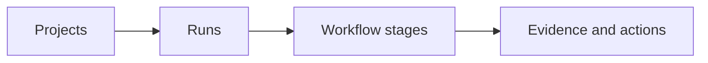

# LoopForge shell UX redesign

Status: phases 0–7 are implemented on `master` as of 2026-07-15. This document
also records the intended UX contract for subsequent changes.

## Outcome

LoopForge should stop presenting the workflow as a large slash-command REPL.
The default interactive experience should be an operator console built around
three nested objects:



The user should always be able to answer, without knowing a command:

1. Which project and run am I looking at?
2. Which stage is active, complete, blocked, or waiting for me?
3. What is LoopForge doing now?
4. What evidence is available?
5. What is the safest next action?

The non-interactive CLI remains stable and scriptable. `--json`, CSV, plain
text, exit codes, stdout/stderr separation, `NO_COLOR`, and `--no-input` must
not depend on the full-screen interface.

## Historical baseline evidence (before phases 1–7)

- `src/loopforge/cli/interactive.py` exposes 64 supported and 30 recognized but
  unsupported commands through one completion catalog. This is too much
  product surface for the default experience.
- `InteractiveShell.run_prompt()` is a prompt with a bottom toolbar, not a
  navigable application. Its home panel shows one project and one current run.
- `loopforge run` uses `RunCockpitService` in `cli/workflow.py`, while `/run`
  calls `create_run` directly in `cli/interactive.py`. The two entry points do
  not provide the same workflow or guidance.
- `TerminalRenderer` in `cli/ui.py` already provides Rich/plain panels,
  tables, status spinners, semantic roles, and fallbacks. It is the correct
  base for non-interactive output, but it is not a screen/navigation model.
- `workflow_progress()` already derives the current stage and actor from the
  selected pack workflow. The full-screen run view should reuse that state.
- `default_run_root()` in `engine/__init__.py` uses only the directory basename.
  Two projects with the same name can resolve to the same run root.
- `list_runs()` and `dashboard_snapshot()` are scoped to the current project.
  There is no global project registry or cross-project attention view.
- The new pack contract in `engine/packs.py` exposes agents, permissions,
  workflow stages, skills, checks, inheritance, and contribution sources. The
  UI does not yet make that useful context visible at the relevant stage.

## Product decisions

### 1. Two rendering modes, one behavior model

Use one action and view-model layer, then render it in two ways:

| Mode | Owner | Use |
| --- | --- | --- |
| Interactive TUI | Textual | Full-screen layout, focus, keyboard input, selectors, dialogs, live operations |
| Text CLI | Rich through `TerminalRenderer` | One-shot commands, CI, redirected output, human summaries |
| Machine output | JSON/CSV serializers | Automation; never includes ANSI, loaders, prompts, or decorative text |

Do not let Rich and Textual both own the live screen. In the TUI,
Textual owns layout and refresh. Rich remains the renderer for
one-shot terminal output.

### 2. Make navigation primary and commands secondary

`loopforge` and `loopforge shell` should open the console. Slash commands stay
available for expert users and compatibility, but the main interaction is:

- arrow keys or `j`/`k` to navigate;
- `Enter` to open or execute the selected safe action;
- `Esc` to go back;
- `Tab` to move focus;
- `Ctrl+P` to open a searchable project/run selector;
- `Ctrl+K` to open the context-aware action palette;
- `?` to show shortcuts for the current screen;
- `Ctrl+C` to interrupt the active operation, then clear input, then exit on a
  second press when idle.

The footer must always show only the keys that work in the current context.

### 3. Add a real project identity and registry

Add a generated `project_id` to `.loopforge/config.json` and a global registry
under `LOOPFORGE_HOME`. The registry maps `project_id` to canonical path,
display name, last-opened time, and last known attention summary.

New run storage should be keyed by `project_id`, not by basename:

```text
<LOOPFORGE_HOME>/projects/<project_id>/runs/<run_id>/
<LOOPFORGE_HOME>/projects/<project_id>/workspaces/<run_id>/
```

Migration from `<home>/runs/<project_name>` must be non-destructive. If the
same `project_id` is found at a new path, ask whether the project moved or was
cloned; never silently merge two repositories.

This registry enables:

- a global home screen;
- multiple repositories with the same directory name;
- recent projects;
- cross-project counts for runs needing approval or blocked;
- reliable `/cd`/project switching without typing paths.

### 4. Keep one selected run per project, show all runs globally

The existing `current_run_id` remains the focused run for a project. The home
screen also lists every recent run across registered projects. Historical
attempts must not be presented as live processes. Until background execution
exists, only the foreground operation launched by the current console may show
`running`.

### 5. Replace internal statuses with user-facing state families

Persisted engine values remain unchanged. The presentation layer maps them to
stable labels:

| Family | Examples of engine state | Label | Marker | Color |
| --- | --- | --- | --- | --- |
| Ready | `ready_for_run`, `loop_contract_ready` | Ready | `●` | cyan |
| Running | foreground research, plan, implementation, verification, review | Running | `◉` | blue/cyan |
| Needs human | draft task, plan approval, review approval | Needs approval | `◆` | yellow |
| Blocked | `adapter_blocked`, `verification_failed`, blocked stage | Blocked | `×` | red |
| Complete | approved/complete stages, verified checks | Complete | `✓` | green |
| Waiting | pending future stages | Waiting | `○` | dim |
| Archived | `archived: true` | Archived | `–` | dim |

Color is never the only signal. Every color has a marker and a text label.

## Information architecture

### Global home

The home screen answers “where does my attention belong?” before it shows
details.

```text
LoopForge                                    3 projects · 2 need attention
──────────────────────────────────────────────────────────────────────────
Projects                    Recent runs
◆ LoopForge          1      ◆ CLI UX redesign            Plan approval
× billing-api        1      × Repair webhook retries     Verification failed
✓ mobile-app         0      ✓ Add login animation        Review complete

Selected: LoopForge
7 runs · Python pack · last opened 2 min ago

Enter open   n new run   Ctrl+P switch   Ctrl+K actions   ? help
```

Default sort order:

1. needs human action;
2. blocked;
3. foreground operation;
4. recently updated;
5. archived, hidden unless requested.

### Project screen

```text
LoopForge  main                               Python · supervised · 7 runs
──────────────────────────────────────────────────────────────────────────
Runs                       Project health
◆ CLI UX redesign          Pack       python
× Fix CI parser            Adapter    codex
✓ Refactor packs           Git        4 changed files
○ Add docs search          Memory     2 proposals

Selected run
Plan ready · waiting for approval · updated 2 min ago

Enter open   n new   f fork   a archive   / filter   Esc projects
```

The header always shows the project name, shortened path when useful, Git
branch, pack, profile, and run count. Paths are secondary/dim and expandable.

### Run screen

```text
LoopForge / CLI UX redesign                  ◆ Needs approval
run-20260715… · LoopForge · main · planner
──────────────────────────────────────────────────────────────────────────
✓ Task  ─  ✓ Research  ─  ◆ Plan  ─  ○ Build  ─  ○ Verify  ─  ○ Review

Plan approval
4 implementation steps · 6 files in scope · 3 success checks

Evidence
research.md       complete
plan.md           ready to review
workspace         unchanged

Next action
Review and approve the implementation plan

Enter review plan   a approve   e evidence   Esc runs   ? help
```

For seven stages, wrap the stepper across two rows below 120 columns. Below 80
columns, show a vertical list with only the current stage expanded.

### Stage detail

Each stage uses the same structure:

1. stage title and actor;
2. plain-language state;
3. output/evidence preview;
4. blockers or required decision;
5. one primary action and at most two secondary actions.

Pack data supplies the stage title, actor, mode, permission set, and artifact.
Internal file paths remain behind an evidence/details view.

### Approval dialog

Never ask only `yes/no`. A gate must say what the user is approving:

```text
Approve implementation plan?

You approve:
- the 4 steps in plan.md;
- changes limited to 6 listed files;
- 3 success checks before review.

Permissions: workspace write · network denied by default

[Enter] Approve   [e] Open plan   [r] Request changes   [Esc] Cancel
```

Task, plan, review, archive, memory promotion, branch creation, and future
publication actions use this pattern with action-specific evidence.

## Visual system

### Semantic tokens

| Token | Default | Use |
| --- | --- | --- |
| `brand` | bold cyan | LoopForge title, focus border |
| `primary` | terminal default | main content |
| `secondary` | dim | ids, timestamps, paths, hints |
| `ready` | cyan | safe next action, selected command |
| `running` | bright blue/cyan | active foreground work |
| `attention` | yellow | approval or user input required |
| `success` | green | completed stage or passed check |
| `danger` | bold red | blocker, failed check, high risk |
| `selected` | reverse/bold | keyboard focus; must work without color |
| `code` | cyan on neutral background where supported | commands, paths, ids |

Support default, light, dark, mono, `NO_COLOR`, 16-color terminals, and an
ASCII marker fallback. Rich should auto-detect the terminal color system
instead of forcing `standard` in every environment.

### Density rules

- Show full run ids only in details or copy actions.
- Show relative paths by default.
- Truncate tasks only when a visible `…` can be opened.
- Show at most five recent runs on home; scrolling reveals the rest.
- Show one blocker in the summary and the full list in stage detail.
- Never repeat the same status in the title, body, and footer.
- Avoid panels around every section; focus, whitespace, and rules establish
  hierarchy. Reserve a border for the selected/decision area.

### Empty states

Every empty state explains why it is empty and offers one action:

- no registered project: `Open the current Git repository`;
- project not initialized: `Initialize LoopForge`;
- no runs: `Create the first run`;
- no evidence: `This stage has not started`;
- no attempts: `Implementation has not run`;
- no memory proposals: `Nothing is waiting for approval`.

## Loaders and live operations

### Timing policy

- Under 250 ms: render the result directly; no spinner flash.
- Unknown duration over 250 ms: spinner plus elapsed time.
- Known finite work: step progress, not a fake percentage.
- Multiple checks: one row per check with queued/running/passed/failed state.
- Non-TTY, JSON, CSV, `--quiet`, and `--no-input`: no animation.
- On completion, replace the loader with a compact receipt; do not leave every
  progress frame in scrollback.

### Operation display

```text
◉ Verifying run · 00:18
✓ Generate complete patch
✓ Enforce diff policy
◉ Run unit tests
○ Classify final risk

Ctrl+C cancel   l show live output
```

Do not invent progress from elapsed time. The operation controller receives
real events such as `stage_started`, `artifact_written`, `check_started`,
`check_finished`, `adapter_output`, `blocked`, and `completed`.

### Loader matrix

| Operation | Display |
| --- | --- |
| Register/open project | delayed spinner while resolving Git root, config, pack, and run summaries |
| Create/fork run | steps: validate task, detect pack, prepare workspace, write contract |
| Research/plan/review agent | spinner with actor, elapsed time, latest safe activity, output toggle |
| Implementation adapter | live stage view, attempt id, adapter, elapsed time, output toggle, cancel |
| Verification | determinate check list because check count is known |
| Pack discovery | delayed spinner only when scanning is noticeable |
| Dashboard/metrics aggregation | delayed spinner with number of projects/runs scanned when known |
| Doctor | one row per diagnostic |
| Copy, clear, theme, title, keymap | no loader; immediate toast |
| Export/compact | delayed spinner; final path and size |

### Errors

Every failure view uses this order:

1. what failed;
2. effect on the run;
3. whether state/artifacts were preserved;
4. the most actionable evidence;
5. one recovery action.

Example:

```text
× Verification blocked
Unit tests failed. The run remains at Verify; no approval changed.

pytest   failed after 12.4s
report   artifacts/verification.md

Enter open failure   r rerun checks   Esc back
```

## Top-level command plan

The following table covers every parser command in `cli/parser.py`. “Component”
is the default human-facing UI; JSON/CSV output remains data-only.

| Command | First-view information | Component and color | Loader | Decision |
| --- | --- | --- | --- | --- |
| `loopforge` | registered projects, attention counts, recent runs | global home; selected row reverse, attention yellow, blocked red | delayed project-index spinner | Make this the primary product entry point. |
| `loopforge shell` / `interactive` | same as `loopforge` | full-screen console | same as home | Keep aliases; `--command` and `--script` remain headless compatibility modes. |
| `loopforge init` | project, generated id, profile, detected pack, storage location | setup summary; success green, repair yellow | step loader only when Git/pack scan exceeds threshold | Register project globally and open its project screen. |
| `loopforge run` | active project/run, task, success checks, pack, permissions | guided wizard or active-run selector; missing requirements yellow | create-run step loader | Never silently replace focus; choose resume, fork, or new. |
| `loopforge status` | project, run, stage stepper, blocker/proof, next action | compact run snapshot | none normally | Reuse the run view model; `--details` expands evidence. |
| `loopforge guide` | one action and one reason | next-action card; action cyan, approval yellow | none | Retain for scripts; in TUI this is the persistent Next action area. |
| `loopforge dashboard` | attention across projects/runs, then selected project health | global/project dashboard depending on scope | delayed aggregation spinner | Add `--all-projects`; stop repeating current-run details in multiple sections. |
| `loopforge runs` | project, current marker, stage, attention, updated time, task | searchable run table; semantic status | delayed scan for large histories | Add `--all-projects`, `--archived`, and interactive selection in TTY. |
| `loopforge continue` | explicitly “contract check” or “implementation attempt”, run, adapter, attempt, changes | operation view then receipt; running cyan, blocked red | live operation | No ambiguous “continue”: label the exact transition before execution. |
| `loopforge verify` | run, real check list, patch, risk, failed check, review action | determinate verification view | per-check progress | Success routes to review, never directly to learning/publication. |
| `loopforge learn` | proposal list, source, pending/promoted/rejected counts | reviewable proposal list; approval yellow | spinner only while deriving/writing proposals | `--approve` opens or prints an evidence-rich approval summary. |
| `loopforge pack list` | detected pack, inheritance, skills/agents/stages counts, bundled/local kind | compact table; current cyan, override yellow | delayed discovery spinner | Add a details action instead of exposing full paths by default. |
| `loopforge pack detect` | chosen pack, evidence, inheritance, workflow size | pack card; chosen cyan | delayed discovery spinner | Explain detection evidence, not only a numeric score. |
| `loopforge metrics record` | run, known/unknown values, destination | compact receipt; unknown yellow/dim | none normally | Keep as an advanced/automation command. |
| `loopforge metrics summarize` | scope, records, averages, unknown counts, signal quality | summary plus optional table | delayed aggregation spinner | Support project/global scope; never render unknown as zero. |
| `loopforge version` | version, Python, platform; diagnostic paths under details | compact diagnostic card | none | Keep stable and suitable for bug reports. |
| `loopforge help` | core workflow first, grouped commands, examples | grouped help; commands cyan | none | Default help shows at most the primary commands; `--all` reveals expert commands. |
| `loopforge completion` | pure completion script on stdout | no decoration | none | Keep install examples in help/stderr, never in script stdout. |

### New top-level navigation commands

| Command | Purpose |
| --- | --- |
| `loopforge projects` | List registered projects with attention, run count, path, and last activity; TTY can select one. |
| `loopforge open [project-or-path]` | Open/register a project and focus it in the console. |
| `loopforge runs --all-projects` | Give a scriptable global run list without opening the TUI. |

These commands are navigation only. They must not execute stages or change run
approval state.

## Interactive command plan

The default command palette should expose roughly 15 context-relevant actions,
not the current 94 recognized names. Existing commands can remain callable for
compatibility while aliases, diagnostics, and unsupported placeholders are
hidden from ordinary completion.

### Start and navigation

| Command | Information and component | Color | Loader | Disposition |
| --- | --- | --- | --- | --- |
| `/init` | setup card with project id, profile, pack | green/yellow repair | step loader | Primary only when project is uninitialized. |
| `/run` | run wizard or current-run resume/fork/new selector | yellow for missing contract fields | step loader | Primary. Plain text may still start a run after a preview. |
| `/new` | same run wizard, explicitly new | same as `/run` | step loader | Hidden alias of `/run --new`; never separate behavior. |
| `/fork` | source run plus inherited task fields, checks, pack, permissions | cyan, changed inherited fields yellow | step loader | Project/run action; confirmation summary before creation. |
| `/runs` | current project run list with attention and stage | semantic statuses | delayed scan | Primary; opens Runs screen. |
| `/dashboard` | current project health, attention, recent runs, checks, memory | semantic statuses | delayed aggregation | Opens the Project overview; do not duplicate the Run detail screen. |
| `/resume` | selected run summary and its next action | selected reverse, state semantic | delayed load only | Replace run-id typing with a selector when no id is supplied. |
| `/archive` | run, retained artifacts, focus after archive | approval yellow, result dim | short spinner | Run action with explicit “artifacts are kept”. |
| `/cd` | registered project selector and new project path option | selected reverse | delayed project scan | Rename visually to Switch project; keep `/cd` compatibility. |

### Workflow actions

| Command | Information and component | Color | Loader | Disposition |
| --- | --- | --- | --- | --- |
| `/status` | run header, stage stepper, one blocker/proof, next action | semantic state | none | Primary; same view model as top-level status. |
| `/guide` | next action, reason, consequence | cyan or yellow when approval | none | Secondary; opens Next action detail. |
| `/next` | focuses the primary action and shows its shortcut | cyan/yellow | none | Primary; pressing Enter should make `/do <id>` unnecessary. |
| `/why` | evidence explaining selected/recommended action | dim evidence, yellow caveat | none | Secondary panel attached to Next action. |
| `/actions` | only actions valid for current screen/run | safe cyan, confirm yellow, dangerous red | none | Replaced visually by `Ctrl+K` palette; keep command. |
| `/do` | action preview, evidence, confirmation if required | action semantic | operation-specific | Expert compatibility; Enter on selected action is the normal path. |
| `/continue` | exact stage/actor/adapter, attempt, changed files, result | running cyan, blocked red | live operation | Primary only when implementation is eligible. |
| `/verify` | real checks, patch, risk, report, failed item | green/red/yellow risk | per-check progress | Primary only when verification is eligible. |
| `/learn` | memory proposals with category/source/status | pending yellow, promoted green, rejected dim | delayed derive/write spinner | Secondary after review, not the automatic next action after verification. |
| `/approve` | selected memory proposals and durable effect | yellow approval, green result | write spinner | Hidden alias/action within Memory screen. |

### Review and evidence

| Command | Information and component | Color | Loader | Disposition |
| --- | --- | --- | --- | --- |
| `/plan` | goal, stage plan, success checks, allowed tools, `plan.md` preview | checklist green/dim, missing yellow | delayed file load only | Primary evidence view at plan gate. |
| `/review` | findings, changed files, verification, risk, decision | finding severity; approval yellow | delayed evidence aggregation | Primary at review stage; support focus filters. |
| `/code-review` | review focused on correctness/maintainability | same as review | same | Hidden alias of `/review --focus code`. |
| `/security-review` | only security-relevant recorded evidence | yellow/red only with evidence | same | Hidden alias of `/review --focus security`; never imply an external audit. |
| `/simplify` | cleanup opportunities supported by diff/review | cyan suggestions | same | Hidden alias of `/review --focus simplify`. |
| `/diff` | file list, additions/deletions, selectable patch viewer | changed cyan, deletion red, addition green | delayed Git spinner for large diff | Project/run Evidence tab. |
| `/tasks` | attempts plus open human actions | semantic state | none | Rename visually to Activity; do not mix attempts and action ids in one table. |
| `/ps` | recorded attempts, never fake live jobs | historical dim, current foreground cyan | none | Hidden alias of `/tasks --attempts`; remove process terminology from UI. |
| `/raw` | attempt id, stdout/stderr/result, tail/full toggle, path | stderr red only for failures; content neutral | delayed file read | Expert log viewer; cap initial lines and support search. |
| `/goal` | task, source, success checks, rubric | missing yellow | none | Fold into Run overview; keep command for quick access. |
| `/recap` | one-line project/run/stage/next action | semantic state | none | Keep minimal and copy-friendly. |

### Context and artifacts

| Command | Information and component | Color | Loader | Disposition |
| --- | --- | --- | --- | --- |
| `/context` | project, run, mentioned paths, extra dirs, memory, size | neutral groups, warnings yellow | delayed size scan | Context screen; do not dump every path by default. |
| `/mention` | selected path, type, size, inclusion scope | success green, large/sensitive warning yellow | stat/spinner only for directory | Context action with path completion. |
| `/add-dir` | directory, estimated size/file count, session-only scope | large-dir warning yellow | bounded scan spinner | Context action; require confirmation for very large directories. |
| `/compact` | focus, source run, output path, byte size | success green | delayed spinner | Artifact action with final open/copy shortcuts. |
| `/copy` | target and clipboard result | success green or fallback yellow | none | Immediate toast; fallback export must be explicit. |
| `/export` | target, format, destination, size | success green | delayed write spinner | Use a small save dialog in TUI. |
| `/memory` | durable facts, proposals, source and status | pending yellow, promoted green | delayed load only | Memory screen. |
| `/memories` | same screen with details expanded | same | same | Hidden alias of `/memory --details`. |

### Packs, permissions, and adapters

| Command | Information and component | Color | Loader | Disposition |
| --- | --- | --- | --- | --- |
| `/pack` | detected pack, inheritance tree, skills, agents, stages | current cyan, local override yellow | delayed discovery | Pack screen with list/detect/details tabs. |
| `/skills` | skills grouped by effective inherited pack and stage | selected cyan | delayed load only | Pack details tab, not a standalone primary command. |
| `/plugins` | local packs only and a precise unsupported note for external plugins | neutral/yellow | none | Hide; label it Packs in UI until plugin management exists. |
| `/permissions` | filesystem, network, external write, publication, destructive policy | allowed green, confirm yellow, denied red | none | Permission screen derived from the current pack/stage. |
| `/allowed-tools` | effective tools for selected stage and source | allowed green, absent dim | none | Permission subview; avoid parsing only `loop.md` when pack data exists. |
| `/sandbox` | engine, workspace, adapter, network, publication boundaries | allowed/denied semantic | none | Permission subview; distinguish LoopForge guarantees from adapter-owned policy. |
| `/adapter` | current adapter, default args, availability, scope of change | selected cyan, unavailable red | probe only on request | Settings selector; saving result is a toast. |
| `/adapters` | supported adapters and current selection | current cyan | optional bounded probe | Fold into `/adapter`; hide plural alias. |

### Project and Git operations

| Command | Information and component | Color | Loader | Disposition |
| --- | --- | --- | --- | --- |
| `/branch` | current branch, dirty state, proposed branch name | dirty/creation yellow, success green | short Git spinner | Project action; preview before `git switch -c`. |
| `/config` | effective values, source, project/user scope | changed yellow, valid green | none on show, short write spinner | Settings form; avoid raw JSON as the default view. |
| `/doctor` | each dependency/config/Git/adapter check and an exact fix | green/yellow/red per check | determinate diagnostic list | Primary troubleshooting screen. |
| `/debug-config` | raw paths, environment, resolved config, registry ids | dim/neutral, invalid red | none | Hidden expert diagnostics; copy/export friendly. |

### Statistics and settings

| Command | Information and component | Color | Loader | Disposition |
| --- | --- | --- | --- | --- |
| `/stats` | attempts, duration, checks, patch, known/unknown tokens/cost | unknown yellow/dim | delayed aggregation | Run Statistics tab. |
| `/usage` | known adapter usage only; source and freshness | unknown yellow | optional adapter probe only | Hidden alias/filter of Statistics; never fabricate. |
| `/cost` | known cost, currency, source, freshness | unknown yellow | none normally | Hidden alias/filter of Statistics. |
| `/theme` | preview and current theme | live preview | none | Settings control; persist at user scope. |
| `/tui` | interactive/text renderer mode and capability | neutral | none | Expert setting; automatic mode remains default. |
| `/statusline` | visible segments and compact/full/off preview | live preview | none | Settings control; persist user preference. |
| `/keymap` | Emacs/Vim plus effective shortcuts | selected cyan | none | Settings control; apply to the current prompt/application immediately. |
| `/vim` | toggles the same keymap setting | selected cyan | none | Hidden alias of `/keymap vim`; do not duplicate state logic. |
| `/title` | optional session label | neutral | none | Low-priority setting; hide from default palette. |

### Help and terminal utilities

| Command | Information and component | Color | Loader | Disposition |
| --- | --- | --- | --- | --- |
| `/commands` | searchable context actions first, expert catalog second | selected cyan | none | Replace tables with command palette; `/commands all` stays expert-only. |
| `/help` | shortcuts/current screen help or command usage/examples | commands cyan | none | `?` opens contextual help; `/help <cmd>` remains. |
| `/clear` | no receipt | none | none | Clear/redraw the application. |
| `/exit` | active-operation warning if needed | warning yellow | none | Exit cleanly. |
| `/quit` | same as exit | same | none | Hidden alias of `/exit`. |

## Recognized but unsupported commands

The 30 entries in `UNSUPPORTED_COMMANDS` must be removed from normal completion.
If typed explicitly, LoopForge should show one sentence and the closest real
surface. Do not make unavailable features look like product navigation.

| Command | Explicit response / destination |
| --- | --- |
| `/advisor` | Not implemented; use the current run review evidence. |
| `/agent`, `/agents` | Agent roles come from the effective pack; open Pack → Agents. Background fleets are not available. |
| `/apps`, `/mcp` | Connector/tool configuration belongs to the selected adapter; open Adapter details. |
| `/background`, `/bg`, `/stop` | Background execution is unavailable; the current foreground operation can be interrupted with `Ctrl+C`. |
| `/batch` | Parallel run execution is unavailable; Projects and Runs can still show multiple recorded runs. |
| `/btw`, `/side` | Side conversations are not persisted. |
| `/delete` | Destructive deletion is unavailable; use Archive. |
| `/effort`, `/fast`, `/model`, `/personality` | Model behavior belongs to adapter arguments; open Adapter settings. |
| `/experimental` | No experimental toggle surface exists. |
| `/feedback` | Show the project issue/reporting instructions, not a fake submission action. |
| `/hooks` | Lifecycle hooks are unavailable. |
| `/ide` | IDE context import is unavailable; use Context → Mention. |
| `/import` | External agent configuration import is unavailable. |
| `/keybindings` | Open Settings → Keymap; persistent custom bindings are not yet available. |
| `/login`, `/logout` | Provider authentication belongs to the adapter. |
| `/rewind` | Checkpoint rewind is unavailable; fork an earlier run when possible. |
| `/sandbox-add-read-dir` | Use Context → Add directory; adapter sandbox grants remain adapter-owned. |
| `/schedule` | Scheduled execution is unavailable. |
| `/ultraplan`, `/ultrareview` | Multi-agent cloud planning/review is unavailable; use the pack planner/reviewer stages. |
| `/usage-credits` | Credit management belongs to the adapter/provider. |

## Shared action and view model

The current top-level handlers and `InteractiveShell.cmd_*` methods format and
orchestrate the same concepts independently. Introduce a shared read-only
presentation layer before building the TUI.

Proposed immutable models:

- `ProjectSummary`: id, name, path, initialized, branch, profile, pack, run
  counts, attention state, last activity;
- `RunSummary`: id, short id, task, project, status family, current stage,
  actor, updated time, archived, next action;
- `StageView`: id, title, actor, permission mode, status family, artifact,
  evidence summary, blockers, gate;
- `ActionDescriptor`: id, label, description, risk, confirmation requirement,
  availability, command fallback, executor key;
- `OperationEvent`: operation id, project/run/stage, kind, timestamp, message,
  progress totals when real, artifact, terminal status;
- `ShellSnapshot`: projects, focused project/run, workflow, evidence, actions,
  foreground operation, notification counts.

`ActionDescriptor` is the single registry used by:

- the TUI action palette;
- guided `Enter` actions;
- `/actions` and `/do`;
- top-level `guide` and next-action output;
- contextual footer shortcuts.

Engine lifecycle APIs remain authoritative. The presentation layer never
edits `run.json`, approvals, or publication fields directly.

## Proposed module boundaries

```text
src/loopforge/cli/
  presentation.py       # state mapping and immutable view models
  actions.py            # shared action registry and execution adapters
  ui.py                 # Rich/plain one-shot renderer
  interactive.py        # compatibility facade and headless slash dispatch
  tui/
    app.py               # prompt_toolkit application and event loop
    state.py             # focus, filters, selected project/run, settings
    operations.py        # foreground worker, cancellation, OperationEvent bridge
    screens/
      home.py
      project.py
      run.py
      evidence.py
      settings.py
    widgets/
      pipeline.py
      selector.py
      action_bar.py
      log_viewer.py
      approval.py
src/loopforge/engine/
  projects.py            # project identity, registry, migration, global summaries
```

Keep `loopforge.cli:main`, `CliContext`, engine result types, `JsonStore`,
`PackRegistry`, `MetricsService`, and current lifecycle APIs. The module list is
a proposed extension, not evidence that these files already exist.

## Implementation phases

### Phase 0 — Freeze behavior and gather UX fixtures

1. Capture golden plain and Rich outputs for uninitialized, no-run, approval,
   blocked adapter, failed verification, review, and archived states.
2. Add fixtures for two same-named projects and several runs at different
   stages.
3. Record current JSON/CSV contracts and exit codes so the redesign cannot
   accidentally change automation behavior.
4. Define the user-facing state-family mapping in tests.

### Phase 1 — Presentation and action core

1. Add the immutable view models and mappers.
2. Move workflow/action eligibility into one `ActionDescriptor` registry backed
   by current engine guidance and approval APIs.
3. Make top-level text output and slash compatibility commands consume those
   models.
4. Remove duplicate render/orchestration choices between `RunCockpitService`
   and `InteractiveShell.cmd_*` without changing engine state transitions.
5. Expand semantic styles and terminal capability handling in `cli/ui.py`.

### Phase 2 — Project registry and global queries

1. Add generated project identities and the global registry.
2. Add collision-safe run/workspace roots.
3. Implement non-destructive migration and duplicate-id handling.
4. Add global project/run summaries and attention sorting.
5. Add `projects`, `open`, and `runs --all-projects` in text/JSON modes.

### Phase 3 — Full-screen navigation

1. Build the `prompt_toolkit` application with Home, Project, Run, Evidence,
   and Settings screens.
2. Implement focus, back navigation, filtering, selectors, responsive layouts,
   contextual footer keys, command palette, and contextual help.
3. Render the pack-driven pipeline and approval dialogs.
4. Keep `shell --command` and `--script` on the compatibility dispatcher; they
   must not require a full-screen terminal.

### Phase 4 — Live operations

1. Run long operations outside the UI event loop.
2. Bridge real engine/subprocess activity into `OperationEvent` values.
3. Add delayed spinners, elapsed time, per-check progress, output toggles,
   cancellation, and final receipts.
4. Ensure interrupted operations persist an honest terminal state and recovery
   action.

### Phase 5 — Command consolidation

1. Limit default completion/palette to context-relevant supported actions.
2. Convert synonyms to aliases backed by one implementation.
3. Hide diagnostics and unsupported commands from ordinary discovery.
4. Rewrite help around the Projects → Runs → Stages model.
5. Persist theme/statusline/keymap at the correct user or project scope.

### Phase 6 — Evidence and review polish

1. Add searchable Markdown, diff, log, check, and memory proposal viewers.
2. Add plan/review approval summaries based on real artifacts.
3. Add open/copy/export actions with consistent toasts and paths.
4. Make blocked states recoverable without requiring `/raw` knowledge.

### Phase 7 — Accessibility, performance, and release

1. Verify 60-, 80-, 120-, and 160-column layouts and terminal resize.
2. Verify mono, `NO_COLOR`, 16-color, light/dark, ASCII, Windows Terminal, and
   redirected-output behavior.
3. Measure warm start, project index, 1,000-run list, and large-log rendering.
4. Add an opt-out `--plain` path and preserve all machine formats.
5. The full-screen console is now the default for interactive TTY sessions.
   Preserve `--plain` as the compatibility/accessible opt-out, and keep
   `--interactive-ui` accepted as a no-op compatibility flag.

## Acceptance criteria

- From the home screen, a user can identify the project/run needing approval or
  blocked without typing a command.
- Two repositories with the same basename never share a run root.
- The project and run identity remain visible on every stage/evidence screen.
- Every run shows the pack-defined workflow and clearly distinguishes complete,
  current, waiting, blocked, and human-gated stages.
- Every eligible stage has one plain-language primary action; internal action
  ids are not required for normal use.
- `loopforge run` and `/run` use the same intake, resume/fork/new decision, and
  result presentation.
- Loaders appear only after the delay threshold and only report real progress.
- `Ctrl+C` can interrupt foreground work without corrupting the run or exiting
  immediately.
- A failed adapter or check exposes the useful evidence and recovery action in
  one view.
- Default completion contains no unsupported commands and no duplicate aliases.
- JSON/CSV payloads, exit codes, stdout/stderr separation, `--no-input`,
  `--quiet`, and no-color behavior remain deterministic.
- The interface remains usable at 60 columns and after terminal resize.
- No screen labels a historical attempt as live or treats verification as
  review/publication authority.

## Recommended delivery order

Do not start with colors or a large widget rewrite. The sequence with the
highest leverage is:

1. shared view/action models;
2. collision-safe project registry;
3. global Home/Project/Run navigation;
4. pack-driven stage and approval views;
5. real live operations;
6. command consolidation and visual polish.

This order fixes the information model first, then makes it visually clear.

## External implementation references

- [`prompt_toolkit` full-screen applications](https://python-prompt-toolkit.readthedocs.io/en/stable/pages/full_screen_apps.html)
  support layouts, styles, event-driven input, focus, and key bindings; use it
  as the interactive screen owner.
- Rich documents [progress displays](https://rich.readthedocs.io/en/latest/progress.html),
  [live displays](https://rich.readthedocs.io/en/latest/live.html), and terminal
  capability detection; keep it for one-shot CLI output and receipts.
- [Claude Code interactive mode](https://code.claude.com/docs/en/interactive-mode)
  documents contextual keyboard controls, history, transcripts, tasks, and
  interrupt behavior; its [status line](https://code.claude.com/docs/en/statusline)
  keeps session identity and operational context visible. Together with the
  Codex session/status examples supplied for this plan, these are references
  for interaction quality, not a reason to copy a single-agent transcript UI.
