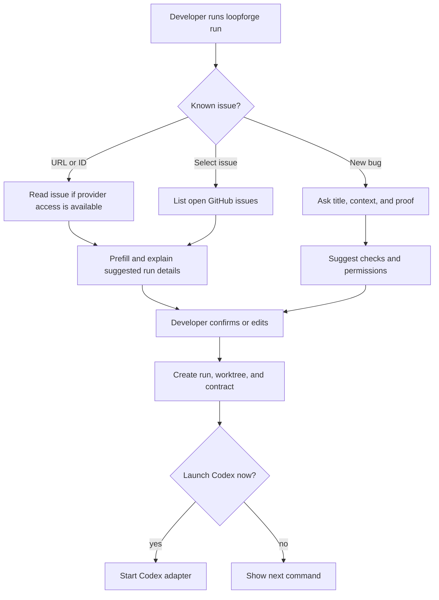

# Guided Run Wizard - Plan

## Goal Capsule

- **Objective:** Make `loopforge run` the primary guided entry point for creating useful runs from either a known issue or a newly discovered bug.
- **Product authority:** The CLI remains the source of truth for the first version; shell, GitHub, GitLab, and future UI surfaces should reuse the same run-intake behavior.
- **Open blockers:** Planning must decide how provider credentials, issue discovery, and AI-assisted suggestions are exposed without hidden network calls or opaque autonomy.

---

## Product Contract

### Summary

`loopforge run` will guide a developer through creating a run without requiring them to know every flag.
It will accept an existing issue or collect a new bug report step by step, explain its suggested checks and permissions, create the run/worktree/contract, and then ask whether to launch Codex.

### Problem Frame

LoopForge already has the core loop pieces: run creation, worktrees, loop contracts, pack checks, adapters, verification, memory, profiles, and a shell.
The current experience still asks the developer to understand too many commands and options before they feel the value.

The pain is highest at the start of work.
When a bug is already tracked, the developer wants to hand LoopForge an issue and get a prepared run.
When a bug is discovered in the moment, the developer needs a short guided intake that turns partial context into a safe, bounded run.

### Key Decisions

- **Wizard CLI first.** The first product move is to make `loopforge run` conversational when invoked without enough information, because that keeps the product portable and close to the existing CLI.
- **Issue source support starts with GitHub.** GitHub is the first integrated issue provider; GitLab follows after the end-to-end issue-to-run path is proven.
- **Suggestions explain themselves.** AI-assisted or pack-derived suggestions must include a short reason so the developer can validate rather than trust a black box.
- **Codex launch is proposed, not automatic.** The wizard creates a ready run and asks before launching Codex, preserving consent at the main mutation boundary.

### Actors

- A1. **Developer:** Starts a LoopForge run and answers or confirms the guided intake.
- A2. **LoopForge CLI:** Detects the input shape, collects missing details, creates the run artifacts, and recommends the next action.
- A3. **Issue provider:** Supplies issue title, body, labels, and metadata when credentials and access are available.
- A4. **Agent adapter:** Receives the prepared run only after the developer chooses to launch it.

### Requirements

**Entry and intake**

- R1. `loopforge run` must start an interactive wizard when required run details are missing and the terminal allows input.
- R2. `loopforge run <issue-url>` must recognize supported issue URLs and use them as the run source.
- R3. `loopforge run <issue-id>` must resolve an issue ID from the current repository remote when the provider and project can be inferred.
- R4. `loopforge run` must allow selecting from open issues when provider access is configured and the user chooses an existing issue path.
- R5. The wizard must fall back to manual summary entry when the issue cannot be read because credentials, access, provider support, or network availability are missing.

**Guided bug creation**

- R6. For a newly discovered bug, the wizard must ask for a concise title or goal before collecting secondary details.
- R7. The wizard must ask how success will be proven in natural language and record the answer as a success check.
- R8. The wizard must propose concrete checks from the detected pack when available and explain why they are relevant.
- R9. The wizard must propose default permissions or allowed tools from the detected pack and ask the developer to confirm or adjust them.
- R10. The wizard must collect a rubric only when the work appears subjective and the active autonomy profile requires one.

**Issue-backed runs**

- R11. For a readable issue, LoopForge must prefill the title, task summary, likely success checks, and source metadata before asking for confirmation.
- R12. Issue text must be treated as untrusted input and must not be promoted to durable memory without the existing memory approval rules.
- R13. The run must preserve the issue URL or provider reference in run evidence so the developer can trace the run back to the original work item.
- R14. GitHub support must cover URL input, inferred ID input, and open-issue selection before GitLab support is considered complete.

**Run creation and launch handoff**

- R15. The wizard must create the same durable run artifacts as the existing non-interactive `run` command, including the run directory, worktree, task, loop contract, and current-run config update.
- R16. After creating the run, LoopForge must summarize the goal, run id, pack, contract status, selected checks, and selected permissions.
- R17. After summarizing, LoopForge must ask whether to launch Codex now instead of starting the adapter automatically.
- R18. If the developer declines the launch, LoopForge must show the single next command needed to continue later.
- R19. Non-interactive usage must remain scriptable through existing flags and stable output formats.

### Key Flows

- F1. Issue URL to ready run
  - **Trigger:** The developer runs `loopforge run <issue-url>`.
  - **Actors:** A1, A2, A3
  - **Steps:** LoopForge detects the provider, reads the issue when allowed, proposes prefilled run details, asks the developer to confirm or edit, and creates the run.
  - **Outcome:** A traceable issue-backed run is ready and the developer is asked whether to launch Codex.
  - **Covered by:** R2, R5, R11, R13, R15, R17

- F2. Issue selection to ready run
  - **Trigger:** The developer starts `loopforge run` and chooses to work from an existing issue.
  - **Actors:** A1, A2, A3
  - **Steps:** LoopForge lists open issues when access is configured, the developer selects one, LoopForge preloads the intake, and the developer confirms the run contract.
  - **Outcome:** The developer does not need to copy issue text or know low-level run flags.
  - **Covered by:** R4, R5, R11, R14

- F3. Newly discovered bug to ready run
  - **Trigger:** The developer starts `loopforge run` without an issue source.
  - **Actors:** A1, A2
  - **Steps:** LoopForge asks for title, bug context, proof of success, suggested checks, and suggested permissions, then creates the run.
  - **Outcome:** A partial bug report becomes a bounded LoopForge run with enough evidence to continue safely.
  - **Covered by:** R1, R6, R7, R8, R9, R15

- F4. Ready run to Codex launch
  - **Trigger:** Run creation completes.
  - **Actors:** A1, A2, A4
  - **Steps:** LoopForge summarizes the run, asks whether to launch Codex, then either starts the adapter or prints the next command.
  - **Outcome:** The developer chooses the launch boundary explicitly.
  - **Covered by:** R16, R17, R18

### Acceptance Examples

- AE1. **Covers R2, R11, R17.** Given a supported GitHub issue URL and valid access, when the developer runs `loopforge run <issue-url>`, then LoopForge proposes prefilled run details and asks before launching Codex.
- AE2. **Covers R3, R5.** Given an issue ID that cannot be resolved from the current remote, when the developer runs `loopforge run 123`, then LoopForge asks for a URL or manual summary instead of guessing.
- AE3. **Covers R6, R7, R8, R9.** Given no issue source, when the developer runs `loopforge run`, then LoopForge asks for the bug title and proof of success before confirming detected checks and permissions.
- AE4. **Covers R19.** Given CI or another non-interactive environment, when `loopforge run` lacks required details, then LoopForge fails with a clear input-required message rather than opening the wizard.

### Success Criteria

- A developer can create a useful run for a new bug by answering about four to five guided prompts.
- A developer can create a useful run from a GitHub issue without manually copying the issue body.
- The final wizard screen makes the run state and Codex launch choice clear.
- Existing scripted `loopforge run --task ...` usage continues to work.

### Scope Boundaries

- GitHub issue ingestion is in scope for the first provider-backed version.
- GitLab issue ingestion is deferred until the GitHub path proves the interaction model.
- A GitHub or GitLab UI button labeled "Resolve" is deferred until the CLI intake is stable.
- Automatic adapter launch without a developer confirmation is out of scope for the MVP.
- Draft PR publication, issue closing, branch pushing, and other external publication actions are out of scope for this plan.

### Dependencies / Assumptions

- The active repository remote can often identify the issue provider and project, but the wizard must handle ambiguity.
- Provider reads require explicit configuration or available credentials; missing credentials are a normal fallback path.
- Pack detection can provide deterministic suggestions even when AI assistance is unavailable.
- Codex is available as an adapter choice in the target developer environment.

### Outstanding Questions

**Deferred to Planning**

- How should provider credentials be configured and diagnosed in the CLI?
- What minimum issue fields should be stored in run evidence without promoting untrusted issue text?
- How should the wizard distinguish pack-derived deterministic suggestions from AI-assisted suggestions?
- What exact confirmation shape should be used before launching Codex?

### Sources / Research

- `README.md` describes the current CLI shape, shell, adapters, and product principle.
- `docs/product-architecture.md` frames the CLI as the user experience and the engine as the owner of run state.
- `docs/cli-ux-command-plan.md` already names conversational `run` behavior as a desired CLI improvement.
- `docs/implementation-plan.md` records the completed run, worktree, contract, adapter, verification, memory, profile, metrics, and dashboard phases.
- `src/loopforge/cli.py`, `src/loopforge/interactive.py`, and `src/loopforge/engine.py` confirm the current command surface and run lifecycle.
