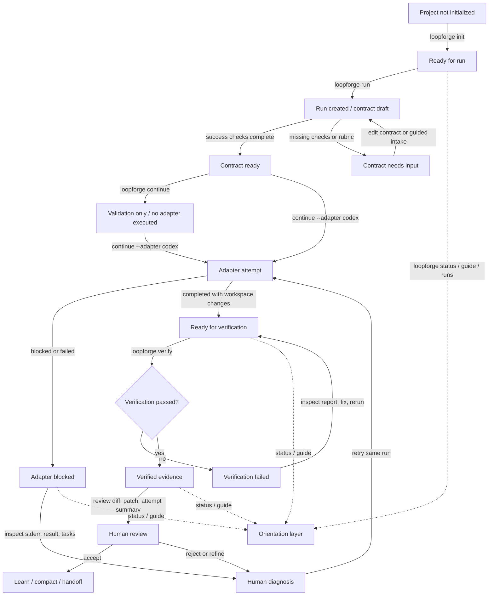

# Run Guidance Map - Plan

## Goal Capsule

- **Objective:** Make LoopForge's CLI orient the operator through an entire run lifecycle, including resume, adapter execution, verification, and human review.
- **Product authority:** User feedback from a real exploratory session is authoritative: the current commands expose internal state but do not make the workflow understandable enough.
- **Open blockers:** Planning must choose exact command surfaces for review helpers and decide whether review is top-level CLI, shell-only, or both.

---

## Product Contract

### Summary

LoopForge should present each run as a navigable lifecycle with visible state, proof, and review paths.
The user should always know whether they are continuing an existing run or creating a new one, whether an adapter actually ran, what changed, how to inspect the result, and what the next safe human action is.

### Problem Frame

The attached test session shows a user getting lost even though the underlying engine recorded enough state.
`loopforge continue` without an adapter validated the contract but did not make the distinction between validation and execution feel obvious.
`loopforge run` then created a new current run even though the previous run was blocked, so the user had to infer whether they had resumed, replaced, or started over.

After the adapter completed, the CLI reported only that work changed and verification was next.
It did not explain what the agent changed, where to review the attempt transcript, which files were affected, or how a human should decide whether the code was trustworthy.
Verification then reported a passing patch and suggested compaction, while the product principle says verification is evidence, not publication authority.

### Key Decisions

- **Lifecycle map over command-by-command receipts.** The existing `Important state / Useful proof / Next action` rule is necessary but incomplete because users also need to know where they are in the overall loop.
- **Resume and new-run creation must be separated.** A command that creates a new current run while another run is blocked should make that transition explicit and give the user a chance to resume, fork, or intentionally replace focus.
- **Validation-only continue must be named as such.** `loopforge continue` with no adapter is a contract check, not an agent attempt, and the output must say that no code ran.
- **Human review is a first-class state.** A verified patch is ready for review or handoff, not done, shipped, or publication-ready.
- **Artifacts are navigation targets.** Attempt stdout, stderr, result JSON, progress, patch, verification report, and workspace diff should appear as review affordances, not hidden receipts.

### Actors

- A1. **Operator:** A human running LoopForge in a terminal who needs fast orientation and enough evidence to trust or reject an agent attempt.
- A2. **Adapter agent:** Codex, Claude Code, Aider, OpenCode, mini-swe-agent, or another adapter that performs bounded work.
- A3. **LoopForge engine:** The local state machine that records run metadata, attempts, artifacts, verification, memory, and guidance.

### Key Flows

- F1. **Resume or start:** When a current run exists, the operator sees its state before creating a new run and can choose resume, fork, or new run.
- F2. **Validate or execute:** The operator can distinguish a contract validation from an adapter attempt before and after `continue`.
- F3. **Inspect blocked work:** A blocked run points to the latest attempt, full blocker text, stderr, result, and attempt history.
- F4. **Review completed work:** A completed attempt shows changed-file evidence before asking the operator to verify.
- F5. **Review verified work:** Passing verification leads to human review options before memory, compaction, or external publication.

### Requirements

**Orientation**

- R1. Every human-facing lifecycle command must show the active run, current lifecycle state, primary blocker or proof, and one recommended action.
- R2. `status` and `guide` must show the user's position in the lifecycle map in plain language, not only the raw run status.
- R3. `runs` must make the current run and recent blocked or verified runs scannable enough that a user can recover where they came from.
- R4. Interruption during intake must report whether a run was created, whether the active run changed, and which command resumes the previous state.

**Run creation and resumption**

- R5. Interactive `run` must detect an existing current run and ask whether to resume, fork, or create a new run before changing focus.
- R6. Non-interactive run creation must make intentional new-run creation explicit in output when it changes the current run from an unfinished run.
- R7. A resumed run must immediately show its status, blocker or proof, and next recommended command.

**Continuation and attempts**

- R8. `continue` without an adapter must render as contract validation and state that no adapter executed.
- R9. `continue --adapter <name>` must render the attempt id, adapter, status, workspace-change summary, and attempt artifact paths.
- R10. A blocked adapter attempt must show the full actionable blocker or provide a direct command and path for the full text.
- R11. A completed adapter attempt must expose what changed before recommending verification.

**Review and verification**

- R12. `verify` success must recommend review before compaction, memory promotion, or any publication-oriented action.
- R13. Verification output must show patch path, risk level, check count, and the most useful review command.
- R14. Verification failure must show the failed check or policy blocker and point to the verification report.
- R15. Review affordances must include at least changed files, patch/diff, latest attempt summary, latest stderr, and verification report.

**Terminal legibility**

- R16. Rich panel output must degrade cleanly when the terminal cannot render box-drawing characters or UTF-8, so pasted logs remain readable.
- R17. Truncated fields must visibly point to a detail command or artifact path whenever truncation hides the actionable part.

### Acceptance Examples

- AE1. **Covers R5, R7.** Given a current run in `adapter_blocked`, when the user starts interactive `loopforge run`, then LoopForge shows the blocked run first and offers resume, fork, or new run before changing `current_run_id`.
- AE2. **Covers R8.** Given a valid contract, when the user runs `loopforge continue` without `--adapter`, then the result says `adapter: not executed` and labels the state as validation-only.
- AE3. **Covers R9, R11.** Given an adapter attempt completes with changes, when the result renders, then the user sees the attempt id, changed-file summary, and commands to inspect diff or attempt artifacts.
- AE4. **Covers R10, R17.** Given an adapter reports blocked with a long reason, when `status` renders, then the default view either shows the full reason or shows a direct command/path to the full reason.
- AE5. **Covers R12, R15.** Given verification passes, when `loopforge verify` returns, then the next action is review-oriented and the output names the patch and verification report.
- AE6. **Covers R16.** Given a terminal or capture path that cannot preserve Rich box characters, when LoopForge renders panels, then the captured text remains readable ASCII or UTF-8 rather than mojibake.

### Success Criteria

- A user can answer these questions from default output after any lifecycle command: which run is active, what state it is in, whether code ran, what changed, how to inspect it, and what to do next.
- A blocked run can be diagnosed from `status` or `guide` without guessing which artifact contains the real failure.
- A passing verification result does not imply publication authority and routes the operator toward review.
- Automated tests cover the confusing session paths: interrupted run intake, active blocked run plus new run attempt, validation-only continue, completed attempt review hints, verification success review hints, and readable no-color or ASCII fallback output.

### Scope Boundaries

- The first version should improve CLI and shell guidance; it does not need a web dashboard redesign.
- The feature should not add network publication, PR creation, or deployment authority.
- The feature should not turn receipts, validation, or metrics into approval authority.
- The feature should avoid a large policy framework and stay aligned with the existing small CLI direction.

### Dependencies / Assumptions

- The engine already records lifecycle statuses, attempts, artifact paths, verification results, and guided actions.
- The CLI already has renderer helpers for summary panels, blockers, guidance, and next commands.
- Exact review command names can be settled during planning; the product requirement is that review paths are visible and reachable.

### Sources / Research

- `docs/cli-ux-command-plan.md` defines the existing command-by-command UX principle.
- `docs/product-architecture.md` states that the CLI should explain next action without exposing receipt chains unless requested.
- `docs/implementation-plan.md` defines the target loop: trigger, intake, loop design, attempt, verification, memory, next action or review.
- `src/loopforge/engine.py` defines lifecycle statuses and current guidance actions.
- `src/loopforge/cli.py` renders `continue` and `verify` results.
- `src/loopforge/ui.py` renders status lines and default next actions.
- `README.md` states that every run should show goal, active loop, evidence, stuck state, retained memory, and human decisions.
