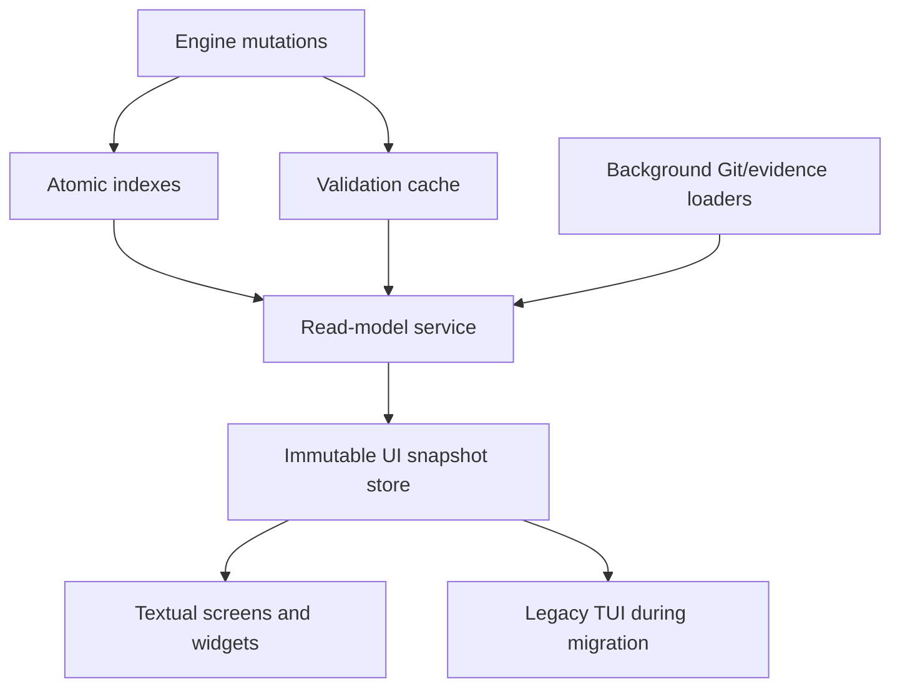

# LoopForge performance and Textual migration plan

Status: planned  
Baseline: `master` at `805a715`  
Scope: interactive performance, scalable read models, background operations,
and migration of the full-screen UI from `prompt_toolkit` to Textual.

## Outcome

LoopForge must feel immediate during navigation regardless of the number of
registered projects, runs, or evidence files. Textual will become the owner of
the full-screen interface, while the existing engine, action descriptors,
plain/Rich CLI, JSON/CSV contracts, and headless shell paths remain stable.

The migration is complete when:

- navigation never performs filesystem scans, JSON parsing, Git commands, or
  validation subprocesses on the UI thread;
- cached key-to-paint latency is below 16 ms at p95;
- a cached screen opens in less than 50 ms at p95;
- a warm first useful frame appears in less than 250 ms at p95 on supported
  developer machines;
- 1,000 runs and 20 registered projects remain responsive;
- idle mode performs no periodic project/run/evidence reload and uses less than
  1% CPU;
- Textual is the default full-screen backend;
- `--plain`, `shell --command`, `shell --script`, JSON/CSV, exit codes,
  confirmations, and stdout/stderr separation remain compatible.

Performance budgets are release gates, not aspirations. Measurements must be
recorded on Linux and Windows because Python and Git process startup is much
more expensive on some Windows installations.

## Measured baseline

The current implementation rebuilds engine state from the render callbacks and
sets `refresh_interval=0.1`. An initialized Run screen therefore executes four
`current_status()` calls, four legacy validation Python processes, and one Git
process per reconstructed frame.

Indicative measurements from the baseline implementation:

| Operation | Mean |
| --- | ---: |
| `current_status()` | 37.36 ms |
| Run header and body reconstruction | 150.43 ms |
| `current_status()` without legacy validation subprocess | 0.39 ms |
| Run header and body without subprocesses | 2.19 ms |
| Actual `list_runs()` with 1,001 run directories | 117.89 ms |

The 150 ms reconstruction cannot satisfy a 100 ms refresh interval. The
reported five-second interaction delay is consistent with the resulting event
backlog and with Git operations that have three- and five-second timeouts.

## Non-negotiable invariants

- Verification remains evidence, not review or publication authority.
- The UI never edits `run.json`, approvals, registry records, or publication
  fields directly.
- Engine mutation APIs remain authoritative and keep atomic persistence.
- No migration may add hidden network, push, PR, publication, or destructive
  behavior.
- The same `ActionDescriptor` registry drives the TUI, guided actions, and
  command fallbacks.
- The effective pack contract remains the only source for stages, actors,
  permissions, skills, and checks.
- Rich remains the one-shot human CLI renderer. Textual owns only the live
  full-screen surface.
- No-color, mono, ASCII, 60-column, terminal-resize, and Windows Terminal
  support are release requirements.
- Missing or stale indexes may reduce freshness temporarily, but must never
  hide persisted run data permanently. A safe rebuild path is required.

## Architecture target



The core rule is strict: render functions receive immutable data and perform
only bounded formatting. All I/O happens before snapshot publication or in a
worker.

### Proposed module boundaries

```text
src/loopforge/
  engine/
    read_models.py       # cheap project/run/status summaries
    indexes.py           # versioned run and registry summary indexes
    validation.py        # cached compatibility artifact validation
    git_state.py         # cached branch/head discovery
  cli/
    state_store.py       # immutable snapshots, revisions, invalidation
    operations.py        # backend-neutral operation/event controller
    tui.py               # temporary backend selector and legacy facade
    textual_app/
      app.py
      messages.py
      workers.py
      styles.tcss
      screens/
        home.py
        project.py
        run.py
        evidence.py
        settings.py
      widgets/
        pipeline.py
        action_bar.py
        operation_panel.py
        approval_modal.py
        evidence_viewer.py
```

These boundaries may be consolidated if a module remains trivial. They must
not create a second engine or action registry.

## Phase 0 — Performance contract and reproducible benchmarks

### Work

1. Add a benchmark fixture generator for:
   - one project and one run;
   - 20 registered projects;
   - 1,000 runs in one project;
   - 10,000 evidence paths with representative Markdown, logs, JSON, and patch
     files;
   - a deliberately slow or unavailable Git executable;
   - Windows-style slow process startup through injected delays.
2. Add a benchmark command that records median, p95, call counts, file reads,
   subprocess starts, and first-frame latency.
3. Record the baseline in a versioned Markdown or JSON result file, including
   OS, Python version, filesystem, and commit.
4. Add deterministic architectural tests that fail if a render callback calls:
   - `subprocess.run`;
   - `Path.rglob`, `Path.read_text`, or JSON stores;
   - `current_status`, `current_guidance`, `list_runs`, or
     `list_registered_projects`.
5. Add lightweight debug timing behind `LOOPFORGE_DEBUG=1`. Do not add
   telemetry.

### Files

- `tests/test_cli_tui_performance_contract.py`
- `tests/fixtures/performance/`
- `tools/benchmark_tui.py`
- `src/loopforge/cli/tui.py`

### Acceptance

- The existing slow path is reproducible without an interactive terminal.
- The benchmark distinguishes formatting time from I/O and subprocess time.
- CI architectural tests are deterministic; wall-clock budgets remain in a
  dedicated benchmark job to avoid flaky unit tests.

## Phase 1 — Stop continuous and duplicate work

This phase is the emergency performance correction and stays on the current
`prompt_toolkit` backend.

### Work

1. Remove `refresh_interval=0.1` from the application.
2. Invalidate only after:
   - selection or navigation changes;
   - a new snapshot is published;
   - an operation event arrives;
   - terminal resize;
   - an active spinner timer ticks.
3. Run the spinner timer only while an operation is active. It may update the
   operation widget at 8–10 FPS but must not reload project state.
4. Compute one screen snapshot per revision and share it across header, body,
   footer, dialogs, and selection-count logic.
5. Replace `_move()` calls to `_projects()`, `list_runs()`, and
   `_evidence_items()` with counts already stored in the snapshot.
6. Introduce `guidance_from_status(status)` as a pure function.
7. Keep `current_guidance(project_dir)` as a compatibility wrapper that loads
   status once and delegates to the pure function.
8. Ensure dialog open/close, help, settings, and movement do not rebuild engine
   state unless their input revision changed.

### Files

- `src/loopforge/cli/tui.py`
- `src/loopforge/cli/presentation.py`
- `src/loopforge/engine/__init__.py`
- `tests/test_cli_tui.py`
- `tests/test_cli_presentation.py`

### Acceptance

- Idle TUI performs zero project/status reloads over 30 seconds.
- One selection movement performs zero I/O and zero subprocess calls.
- One explicit state refresh loads status at most once.
- Existing live-operation animation and cancellation remain functional.
- Run header/body reconstruction stays below 5 ms on the benchmark fixture
  once a snapshot is available.

## Phase 2 — Make status reads cheap and side-effect free

### Problem

`current_status()` currently validates legacy artifacts by launching a new
Python interpreter and calls `ensure_project_memory()`, which can create files
during a read.

### Work

1. Extract legacy validation into a reusable in-process service rather than a
   CLI-only subprocess path.
2. Run validation when compatibility artifacts are created or changed, during
   explicit verification/doctor flows, or during a background cache refresh.
3. Persist a compact validation cache containing:
   - schema version;
   - validator version;
   - artifact signature;
   - validation status and bounded errors;
   - validation timestamp.
4. Define the signature from the relevant artifact names, sizes, and
   nanosecond mtimes. Use content hashing only when metadata is insufficient.
5. Return cached `valid`, `invalid`, `unchecked`, or `stale` state from
   `current_status()` without launching a subprocess.
6. Move project-memory creation to `init`, migration, and run creation.
7. Make missing memory during a read produce an explicit `missing` state rather
   than creating the file.
8. Keep the old validation launcher working for compatibility and tests, but
   make it call the shared validation service.
9. Audit every function reached by `current_status()` and remove remaining
   writes or unbounded work.

### Files

- `src/loopforge/engine/__init__.py`
- `src/loopforge/engine/validation.py`
- `src/loopforge/checks/validate_artifacts.py`
- `.agent/checks/validate_artifacts.py`
- `tests/test_engine_services.py`
- `tests/test_cli.py`

### Acceptance

- Warm `current_status()` stays below 5 ms p95 on Windows and below 2 ms p95 on
  the Linux benchmark environment.
- Calling status 100 times launches no subprocess and changes no file.
- Editing an artifact invalidates only its validation cache.
- Explicit validation still reports the same errors as the current validator.

## Phase 3 — Versioned run and project indexes

### Run index

Add `<run_root>/index.json` with only fields required for list and attention
views:

```json
{
  "index_version": 1,
  "updated_at": "...",
  "runs": [
    {
      "run_id": "...",
      "task": "...",
      "status": "...",
      "attention": "...",
      "pack": "...",
      "archived": false,
      "created_at": "...",
      "updated_at": "..."
    }
  ]
}
```

### Project summary index

Extend registry records, or add a versioned companion index, with:

- `current_run_id`;
- `run_count`;
- `attention`;
- `last_activity`;
- `last_known_branch` and Git head signature;
- summary revision and source timestamp.

### Work

1. Centralize every engine mutation through one persistence hook. `run.json`
   remains authoritative and is written atomically first; run/project indexes
   are derived data updated immediately afterwards.
2. Create a small dirty marker before the authoritative mutation and remove it
   only after both derived indexes are updated. A crash may leave a stale
   index, but the next reader can detect the marker and rebuild from
   `run.json` without losing workflow state.
3. Update indexes after create, resume, archive, approvals, stage completion,
   verification, review, publication preparation, and migration.
4. Make `list_runs()` read the index rather than every `run.json`.
5. Make `list_registered_projects()` read summary records without entering
   each project directory.
6. Rebuild a missing, dirty, or incompatible index safely from persisted runs.
7. Perform TUI-triggered rebuilds in a worker and display stale-but-identified
   data until completion.
8. Add `loopforge doctor` diagnostics and an explicit safe index-rebuild
   action.
9. Never delete or rewrite a valid `run.json` during index repair.
10. Preserve fallback scanning for old installations and migration tests.

### Files

- `src/loopforge/engine/indexes.py`
- `src/loopforge/engine/projects.py`
- `src/loopforge/engine/__init__.py`
- `src/loopforge/engine/storage.py`
- `tests/test_engine_services.py`
- `tests/test_cli_ux_contracts.py`

### Acceptance

- Warm listing of 1,000 runs stays below 20 ms p95.
- Opening Home with 20 projects reads no project-local config or run file.
- A warm list reads one compact index and zero `run.json` files.
- Every successful workflow mutation attempts the affected summary update;
  interrupted derived writes are detected and repaired from authoritative
  state.
- Interrupted index writes leave the previous valid index readable.
- A missing or corrupted index is recoverable without run loss.

## Phase 4 — Cached Git state

### Work

1. Replace the duplicate branch readers with one `GitStateService`.
2. Read `.git/HEAD` directly for the common case, including worktrees where
   `.git` is a file pointing to the real Git directory.
3. Cache results by resolved project path and HEAD signature.
4. Use a background Git subprocess only as a fallback.
5. Bound fallback Git commands to a short timeout, catch `TimeoutExpired`, and
   return an explicit unavailable/stale state instead of blocking or crashing.
6. Never compute Git branch or dirty state from a render callback.
7. Refresh Git state after LoopForge branch operations and on manual refresh.
8. If background polling is retained, use a conservative interval and compare
   signatures before invoking Git.

### Files

- `src/loopforge/engine/git_state.py`
- `src/loopforge/engine/projects.py`
- `src/loopforge/cli/tui.py`
- `src/loopforge/cli/interactive.py`
- `tests/test_engine_services.py`

### Acceptance

- Normal branch lookup launches no subprocess.
- A hung Git executable cannot block the UI.
- Detached HEAD, non-Git directories, worktrees, deleted paths, and branch
  changes have explicit tested behavior.

## Phase 5 — Lazy evidence and large-output handling

### Work

1. Separate evidence metadata from evidence content.
2. Build an `EvidenceIndex` only when entering the Evidence screen or when an
   operation reports a new artifact.
3. Store path, kind, label, size, mtime, and bounded searchable-content cache
   separately.
4. Load preview content only for the selected item.
5. Read previews in bounded chunks rather than `read_text()` on the complete
   file.
6. Cache preview/search results by `(path, size, mtime_ns)`.
7. Debounce search input and run content search in a worker.
8. Publish partial search results progressively for large evidence sets.
9. Virtualize large logs and patches by line window. Never place an entire
   multi-megabyte file in a widget.
10. Invalidate only the evidence item created or changed by an
    `OperationEvent`.

### Files

- `src/loopforge/cli/evidence.py`
- `src/loopforge/cli/state_store.py`
- `src/loopforge/cli/operations.py`
- `tests/test_cli_evidence.py`

### Acceptance

- Moving selection in Evidence performs no filesystem read.
- Opening a preview reads at most the configured preview window.
- A 100 MB log remains navigable without a proportional memory allocation.
- Searching 10,000 files never blocks keyboard handling.

## Phase 6 — Backend-neutral snapshot and operation layer

This is the bridge between the optimized engine and both TUI implementations.

### Snapshot model

Introduce immutable, revisioned snapshots:

- `HomeSnapshot`;
- `ProjectSnapshot`;
- `RunSnapshot`;
- `EvidenceSnapshot`;
- `SettingsSnapshot`;
- `OperationSnapshot`;
- aggregate `UiSnapshot`.

Each snapshot records loading, ready, stale, empty, blocked, and failed states
explicitly. Screens must not infer loading from missing data.

### Work

1. Add a `StateStore` that owns the current project/run selection, cached read
   models, snapshot revision, and invalidation reasons.
2. Publish a new immutable snapshot only when observable state changes.
3. Coalesce multiple engine events into one publication.
4. Keep navigation state separate from persisted workflow state.
5. Turn `ForegroundOperation` into, or wrap it with, a backend-neutral
   `OperationController`.
6. Preserve cancellation and bounded event history.
7. Ensure worker threads never mutate widgets directly; they post results to
   the UI backend.
8. Give each async load an identity/revision so a late result cannot overwrite
   a newer project or run selection.
9. Make the optimized legacy TUI consume the store before starting Textual
   migration.

### Files

- `src/loopforge/cli/state_store.py`
- `src/loopforge/cli/models.py`
- `src/loopforge/cli/presentation.py`
- `src/loopforge/cli/operations.py`
- `src/loopforge/cli/tui.py`
- `tests/test_cli_presentation.py`
- `tests/test_cli_tui.py`

### Acceptance

- Legacy TUI behavior remains correct while all screen rendering is pure.
- Late background results are discarded after project/run navigation.
- Rapid operation events cause at most one pending UI refresh per event-loop
  turn.
- Snapshot construction has deterministic unit tests independent of either UI
  framework.

## Phase 7 — Textual foundation and controlled coexistence

### Dependency strategy

1. Add Textual to `pyproject.toml` with a minimum version chosen and documented
   by the spike according to the APIs used.
2. Keep Rich explicit because LoopForge uses it outside Textual.
3. Keep `prompt_toolkit` during migration for the legacy full-screen backend
   and compatibility prompt.
4. Do not make Textual imports affect headless commands or discovery-command
   startup.

### Backend selection

Keep `src/loopforge/cli/tui.py` as a thin temporary facade. During migration,
use an internal, non-contract selector such as
`LOOPFORGE_TUI_BACKEND=legacy|textual`:

1. legacy remains default while foundations are incomplete;
2. Textual becomes opt-in for development and tests;
3. Textual becomes default after parity and performance gates;
4. legacy remains an emergency fallback for one stabilization cycle;
5. remove the selector and legacy backend after the exit criteria are met.

`--plain` is not part of this selector and must always bypass full-screen
frameworks.

### Textual foundation

1. Create `LoopForgeApp` with bindings matching the current UX contract.
2. Connect `StateStore` publications to Textual messages.
3. Use Textual workers for background reads and bridge long engine operations
   through the backend-neutral operation controller.
4. Add global CSS tokens for brand, ready, running, attention, success, danger,
   selected, code, and secondary content.
5. Implement responsive breakpoints for 60, 80, 120, and 160 columns.
6. Add application-level error boundaries and a recoverable error screen.
7. Add the built-in command palette using the shared action registry; do not
   create another command catalog.
8. Add Textual `run_test()`/Pilot tests from the start.

References:

- [Textual reactivity](https://textual.textualize.io/guide/reactivity/)
- [Textual workers](https://textual.textualize.io/guide/workers/)
- [Textual testing](https://textual.textualize.io/guide/testing/)
- [Textual command palette](https://textual.textualize.io/guide/command_palette/)

### Acceptance

- A minimal Textual app renders Home from a supplied snapshot without I/O.
- Project loading happens in a worker and never blocks key handling.
- Headless commands do not import Textual.
- Pilot tests cover navigation, resize, cancellation, and backend exit.

## Phase 8 — Screen-by-screen Textual migration

Migrate vertical slices rather than recreating every widget before testing.

### 8.1 Home

- Projects ordered by attention and recency.
- Recent runs from global indexes.
- Loading/stale/unavailable states.
- Project switching and filtering.
- No per-project I/O.

### 8.2 Project

- Indexed run list with incremental row population.
- Filter, selection, new run, resume, archive, and safe empty states.
- Project health and cached Git state.
- Responsive layout at all supported widths.

### 8.3 Run

- Pack-driven pipeline widget.
- Current actor, status family, blockers, evidence, and primary action.
- Operation panel with delayed spinner, elapsed time, real progress, output,
  cancellation, and final receipt.
- No historical attempt displayed as a live process.

### 8.4 Approval modals

- Task, plan, review, archive, memory, branch, and draft preparation dialogs.
- Exact evidence and permissions shown before approval.
- Focus trapping, Escape cancellation, and keyboard-only operation.

### 8.5 Evidence

- Lazy indexed list.
- Markdown, JSON, diff, check, and log views.
- Search, open, copy, and export.
- Virtualized large-file display.

### 8.6 Settings and diagnostics

- Theme, statusline, keymap, adapter, and effective configuration.
- Doctor/debug information separated from ordinary navigation.
- Preferences persist at the existing user/project scopes.

### 8.7 Palette and contextual help

- Shared `ActionDescriptor` source.
- Context-aware actions first.
- Unsupported commands hidden from discovery.
- Current-screen shortcuts in footer/help.

### Acceptance for each vertical slice

- Pilot tests reproduce the complete keyboard journey.
- Snapshot and action tests are shared with the legacy backend.
- Plain/headless behavior remains unchanged.
- Performance budgets pass before migrating the next expensive view.

## Phase 9 — Cutover, legacy removal, and dependency decision

### Cutover gates

Textual becomes the default only when:

- Home, Project, Run, Evidence, Settings, dialogs, palette, and live operations
  meet parity;
- Windows and Linux performance budgets pass;
- Ctrl+C behavior matches the UX contract;
- 60-column, resize, mono, no-color, and ASCII tests pass;
- scripted/headless commands have unchanged golden outputs;
- no P0/P1 accessibility or data-integrity issue is open.

### Work

1. Make Textual the default interactive backend.
2. Retain the legacy backend behind the internal selector for one stabilization
   cycle.
3. Collect local debug timings and fix regressions; do not add telemetry.
4. Remove the legacy full-screen implementation and its backend-specific tests.
5. Keep `tui.py` as the stable launch facade or replace imports atomically.
6. Decide separately whether `prompt_toolkit` remains useful for the `--plain`
   compatibility prompt:
   - keep it if history/completion justify the dependency;
   - otherwise replace only that prompt path with a small line-oriented input
     implementation and remove the dependency.
7. Update README, agent documentation, CLI UX plan, dependency notes, and
   troubleshooting documentation.

### Acceptance

- There is one full-screen implementation and one action/state model.
- Removing legacy code does not change plain, JSON, CSV, command, or script
  behavior.
- Fresh install, editable install, upgrade, and uninstall leave no missing
  runtime dependency.

## Phase 10 — Release hardening and regression gates

### Required test matrix

| Area | Cases |
| --- | --- |
| Terminals | Windows Terminal, PowerShell, cmd, common Linux terminals, SSH |
| Width | 60, 80, 120, 160 columns and live resize |
| Color | dark, light, mono, `NO_COLOR`, ASCII, 16-color |
| Scale | 0/1/1,000 runs; 0/1/20 projects; small/large logs |
| State | setup, empty, approval, running, blocked, failed, complete, archived |
| Input | arrows, j/k, Tab, Enter, Escape, Ctrl+P, Ctrl+K, Ctrl+C |
| Failures | corrupt JSON/index, missing path, hung Git, worker error, cancellation |
| Compatibility | `--plain`, `--no-input`, command/script, JSON/CSV, redirected output |

### Performance gates

| Metric | Target |
| --- | ---: |
| Cached selection key-to-paint p95 | < 16 ms |
| Cached screen transition p95 | < 50 ms |
| Warm first useful frame p95 | < 250 ms |
| Warm `current_status()` Windows p95 | < 5 ms |
| Warm 1,000-run list p95 | < 20 ms |
| Render-path subprocess count | 0 |
| Render-path filesystem/JSON reads | 0 |
| Idle project/status reloads in 30 seconds | 0 |
| Idle CPU | < 1% |

If a wall-clock target is unstable in shared CI, keep the deterministic call
count gate in required CI and run the latency target in a controlled benchmark
job. Both results remain visible.

### Final validation

From the repository root:

```text
python -m unittest
python tools/benchmark_tui.py --scenario all
git diff --check
```

Run the benchmark once with the legacy backend before removal and once with
Textual. Store both result sets with the same fixture and machine metadata.

## Delivery sequence and commit boundaries

Critical path:

```text
Phase 0 -> Phase 1 -> Phase 2 -> Phases 3/4/5 -> Phase 6
        -> Phase 7 -> Phase 8 -> Phase 9 -> Phase 10
```

Phases 3, 4, and 5 may proceed independently after status reads are pure, but
all three must be integrated into the snapshot store before Textual becomes a
default-backend candidate.

Keep commits independently reviewable and reversible:

1. performance fixtures and baseline;
2. event-driven legacy refresh;
3. single-status snapshot/guidance path;
4. cached in-process artifact validation;
5. side-effect-free status reads;
6. run/project indexes and migration;
7. cached Git state;
8. lazy evidence index and preview;
9. backend-neutral state and operation store;
10. Textual dependency, app shell, and Pilot harness;
11. Home and Project screens;
12. Run, operation, and approval screens;
13. Evidence and Settings screens;
14. default-backend cutover;
15. legacy removal and documentation.

Do not combine index migration, engine lifecycle changes, and the initial
Textual port in one commit. Each changes a different failure domain and needs a
separate rollback point.

## Main risks and mitigations

| Risk | Mitigation |
| --- | --- |
| Textual migration reproduces current I/O-in-render problem | Complete phases 1–6 first; enforce no-I/O render tests. |
| Index diverges from `run.json` | Keep `run.json` authoritative; use dirty markers, centralized hooks, and safe rebuild. |
| Background result overwrites a newer selection | Tag work with project/run and snapshot revision; discard stale results. |
| Validation cache hides artifact edits | Versioned signature and explicit stale state; validate on mutation and doctor. |
| Git hangs on Windows or network drives | Direct HEAD read, background fallback, short timeout, cached unavailable state. |
| Large logs exhaust memory | Chunked reads, line windows, bounded cache, virtualized viewer. |
| Two TUI implementations diverge | Shared store/actions, short coexistence, vertical parity tests, defined removal gate. |
| Textual slows CLI startup | Lazy import only after TTY/default-interactive decision. |
| Compatibility prompt loses behavior | Keep `prompt_toolkit` until a separate evidence-based dependency decision. |
| Flaky performance tests block delivery | Deterministic required call-count tests plus controlled latency benchmarks. |

## Definition of done

- All phase acceptance criteria pass.
- Textual is the only full-screen implementation.
- The UI thread performs no blocking engine, disk, Git, validation, or evidence
  work.
- Engine reads are side-effect free and indexed at scale.
- User-visible state is never silently stale; loading and stale states are
  explicit.
- Linux and Windows meet the release performance budgets.
- Existing CLI and workflow safety contracts remain unchanged.
- Documentation describes the final architecture rather than the migration
  scaffolding.
