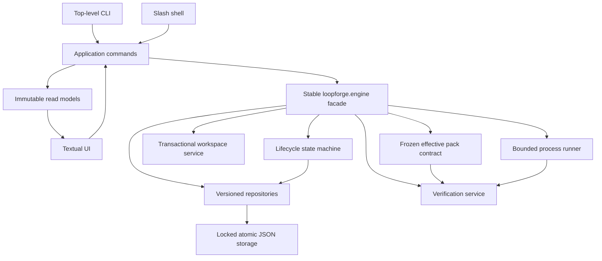
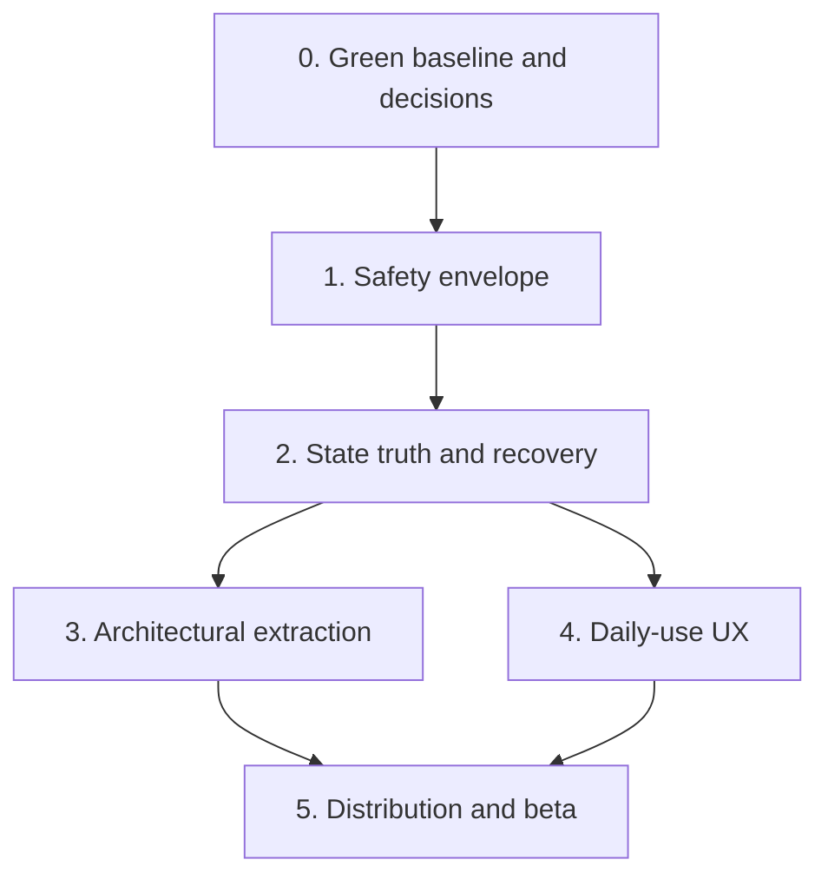

# LoopForge product hardening - Plan

## Goal Capsule

- **Objective:** transformer LoopForge 0.1.0, aujourd'hui au stade alpha/POC, en un outil local fiable pour un usage quotidien et partageable avec d'autres developpeurs.
- **Product authority:** l'autonomie reste bornee; la verification produit des preuves mais ne remplace jamais la revue humaine ni l'autorite de publication.
- **Execution profile:** stabilisation, securisation, refactorisation incrementale, reconstruction UX ciblee, puis industrialisation de la distribution.
- **Release blockers:** choix de licence, politique officielle pour les projets non-Git, plateformes supportees et canal de distribution public.
- **Estimated horizon:** 14 a 20 semaines pour une personne, ou 10 a 14 semaines pour deux personnes experimentees travaillant en parallele apres la phase de securisation.

---

## Product Contract

### Summary

LoopForge doit devenir un moteur de workflow local dont l'etat, la cible et les effets sont toujours explicites, reproductibles et recuperables.
La priorite est de corriger les failles de confiance et de cycle de vie avant d'ajouter des fonctionnalites ou de polir l'interface.
La refactorisation preserve `loopforge.cli:main`, les formats machine et le principe de validation humaine, tout en remplaçant les chemins de comportement divergents par des services uniques.

### Problem Frame

Le depot contient de bonnes fondations: ecritures JSON atomiques, index derives, worktrees par run, contrats d'adapter, verification separee de la revue et facade CLI stable.
Cependant, ces invariants ne sont pas appliques de bout en bout.
Une configuration persistee peut sortir des racines gerees, un pack local peut executer des commandes avec l'environnement parent, `verify` peut contourner les etapes du workflow, et plusieurs actions TUI peuvent viser un autre projet ou run que celui affiche.

Le produit a aussi trois implementations partielles du meme comportement: commandes top-level, commandes slash et actions Textual.
Le moteur central concentre 8 169 lignes physiques et 251 definitions de premier niveau dans `src/loopforge/engine/__init__.py`.
La suite de 229 tests est consequente mais rouge, monolithique et insuffisante sur les pannes, la concurrence et les frontieres de securite.
Enfin, aucune CI, licence ou chaine de release ne permet actuellement de partager le projet avec des garanties raisonnables.

### Audit verdict

**Verdict:** ne pas recommander LoopForge pour des depots sensibles ni le distribuer publiquement avant la fin des phases 0 a 2.
Le produit est une alpha ambitieuse avec des concepts solides, mais pas encore un outil quotidien fiable.

| Dimension | Note sur 5 | Constat |
| --- | ---: | --- |
| Correction du workflow | 1.5 | Les gates sont modelises mais `verify` peut les contourner et les criteres de succes ne sont pas executes. |
| Surete et isolation | 1.5 | Confinement de chemins, confiance des packs et gestion des processus comportent des failles critiques. |
| Persistance et recuperation | 2.0 | Les remplacements de fichiers sont atomiques, mais les transactions, verrous, migrations et recuperations sont incomplets. |
| UX quotidienne | 1.5 | La cible, l'etat, l'annulation et les actions conseillees peuvent etre faux ou incoherents. |
| Maintenabilite | 1.5 | Le moteur et les tests CLI sont monolithiques, avec des chemins de comportement dupliques. |
| Verification automatisee | 2.5 | 229 tests et de bons contrats existent, mais la suite supportee est rouge et les cas de panne majeurs manquent. |
| Distribution et contribution | 1.0 | Pas de licence, CI, processus de release ni installation utilisateur documentee et testee depuis un artefact publie. |

### Audit evidence

L'audit a combine lecture structurelle, recherches ciblees, deux executions independantes de la suite complete, suites focalisees, construction de wheel et reproductions temporaires hors du depot.

#### Critical findings

| Domaine | Comportement observe | Preuve principale | Impact |
| --- | --- | --- | --- |
| Confinement | `project_id`, `run_id` et un ancien `run_root` sont joints ou recopies sans preuve qu'ils restent sous la racine geree. | `src/loopforge/engine/projects.py:43`, `src/loopforge/engine/__init__.py:1926`, `src/loopforge/engine/__init__.py:3867` | Lecture, copie ou ecriture hors stockage LoopForge; un `run_id` altere peut aussi selectionner puis persister comme courant un run hors racine. |
| Confiance des packs | Un pack local sous `.loopforge/packs` peut etre auto-detecte; ses checks executent une liste d'arguments avec une copie complete de `os.environ`. | `src/loopforge/engine/packs.py:37`, `src/loopforge/engine/__init__.py:7352` | Execution de code du depot avec acces potentiel aux secrets et au reseau. |
| Cycle de vie | `verify_run()` ne controle pas que tache, recherche, plan et implementation ont franchi leurs gates avant de marquer le run verifie. | `src/loopforge/engine/__init__.py:7631`, `src/loopforge/engine/__init__.py:7938` | Un run draft ou non approuve disposant d'un `base_commit` et de checks reussis peut etre presente comme verifie. |
| Preuves | `success_checks` participe au contrat et au prompt, mais reste une liste textuelle sans liaison avec les commandes executees par `verify_run()`. | `src/loopforge/engine/__init__.py:5043`, `src/loopforge/engine/__init__.py:7865` | Tests, build ou resultat attendu peuvent etre faux alors que la verification passe. |
| Processus | Plusieurs runners tamponnent toute la sortie et le timeout ne garantit pas l'arret de l'arbre de processus. | `src/loopforge/engine/__init__.py:5293`, `src/loopforge/engine/__init__.py:6857`, `src/loopforge/checks/isolated_process.py:384` | OOM, blocage et descendants continuant a modifier le workspace apres timeout. |
| Cible TUI | Sur l'ecran projet, le run surligne n'est pas capture par l'action Archive, qui archive toujours le `current_run_id`. | `src/loopforge/cli/textual_app/app.py:138`, `src/loopforge/cli/textual_app/app.py:487`, `src/loopforge/engine/__init__.py:2144` | Le run archive peut differer de celui que l'utilisateur a selectionne visuellement. |
| Courses UI | Les workers de preview et d'export d'evidence ne capturent ni ne revalident l'identite projet/run apres une navigation. | `src/loopforge/cli/textual_app/app.py:211`, `src/loopforge/cli/textual_app/app.py:599` | Une evidence ancienne peut etre affichee ou exportee dans la cible courante. |
| Annulation | Certaines mutations ignorent le token, mais `_operation_result()` remplace ensuite le resultat par `cancelled` si le token est pose. | `src/loopforge/cli/textual_app/app.py:342`, `src/loopforge/cli/textual_app/app.py:771`, `src/loopforge/cli/operations.py:61` | Le message utilisateur peut nier une mutation deja persistee. |
| Sortie machine | Les loaders Rich ecrivent sur stdout avant le branchement `--json` ou `--quiet` sur un TTY. | `src/loopforge/cli/workflow.py:60`, `src/loopforge/cli/ui.py:131` | JSON invalide et automatisations fragiles. |
| Lecture d'artefact | `/raw` fait confiance aux chemins absolus ou relatifs de `run.json` sans confinement. | `src/loopforge/cli/interactive.py:1751` | Un run altere peut divulguer un fichier local lisible. |

#### High findings

| Domaine | Comportement observe | Preuve principale | Impact |
| --- | --- | --- | --- |
| Concurrence | `JsonStore` remplace atomiquement un fichier mais les registres et index font des read-modify-write sans verrou ni revision. | `src/loopforge/engine/storage.py:15`, `src/loopforge/engine/projects.py:101`, `src/loopforge/engine/indexes.py:125` | Derniere ecriture gagnante, mises a jour perdues et index declare propre mais obsolete. |
| Corruption | Un registre JSON illisible devient silencieusement un registre vide. | `src/loopforge/engine/projects.py:55` | Perte apparente puis ecrasement possible des inscriptions de projets. |
| Creation de run | Le repertoire et le worktree sont crees avant la validation du pack; le nettoyage ne couvre pas les erreurs tardives. | `src/loopforge/engine/__init__.py:4949`, `src/loopforge/engine/__init__.py:4972` | Runs, repertoires et worktrees orphelins. |
| Packs effectifs | L'heritage affiche un contrat hydrate, mais certains loaders relisent directement le pack enfant par son nom. | `src/loopforge/engine/packs.py:205`, `src/loopforge/engine/packs.py:499`, `src/loopforge/engine/__init__.py:7309` | Checks, chemins proteges et regles de memoire affiches mais non appliques. |
| Risque | La session d'implementation force `risk=low`; le classifieur de patch n'ajoute pas les gates annonces. | `src/loopforge/engine/__init__.py:5538`, `src/loopforge/checks/classify_patch_risk.py:19` | Les routes et approbations basees sur le risque sont decoratives. |
| Reception d'adapter | La politique exige des garanties de fin de processus que `validate_result()` ne controle pas. | `src/loopforge/contracts/policies/implementation-result-validation.json:30`, `src/loopforge/checks/validate_implementation_result.py:121` | Un resultat metier peut etre accepte malgre une terminaison anormale. |
| Migration | Collision de racines et regeneration d'identite peuvent laisser un `current_run_id` orphelin. | `src/loopforge/engine/__init__.py:1975`, `src/loopforge/engine/projects.py:144` | Historique inaccessible ou clone lie a un run absent. |
| Projet non-Git | Un run mutable peut demarrer en `shared-checkout`, puis la verification echoue obligatoirement sans `base_commit`. | `src/loopforge/engine/__init__.py:2275`, `src/loopforge/engine/__init__.py:7706` | Mutation du vrai checkout suivie d'une impasse tardive. |
| Actions conseillees | Des actions marquees disponibles n'ont aucun executeur reel; `verification_blocked` en propose une en premier. | `src/loopforge/cli/actions.py:45`, `src/loopforge/cli/interactive.py:501`, `src/loopforge/engine/__init__.py:3454` | Enter echoue precisement quand l'utilisateur a besoin d'une recuperation guidee. |
| Parite des facades | `run`, `/run` et la TUI ne suivent pas les memes parcours d'initialisation, reprise, gates et guidance. | `src/loopforge/cli/workflow.py:28`, `src/loopforge/cli/interactive.py:1002` | Etat et resultat dependent de la surface utilisee. |
| Configuration de projet | Changer de projet TUI ne recharge pas toujours l'adapter et ses arguments; changer d'adapter conserve les anciens arguments. | `src/loopforge/cli/textual_app/app.py:188`, `src/loopforge/cli/textual_app/app.py:272` | Une commande peut utiliser l'adapter ou les options d'un autre projet. |
| Etat visible | L'ecran peut afficher `ready` tandis que le corps est bloque, et les ecrans de decision omettent projet ou run. | `src/loopforge/cli/state_store.py:285`, `src/loopforge/cli/textual_app/app.py:660` | Decisions humaines prises avec une cible ou une etape ambigue. |
| Test supporte | `python -m unittest` execute 229 tests mais termine avec deux echecs et une erreur reproductibles. | `tests/test_cli.py:1676`, `tests/test_cli.py:2719`, `tests/test_cli_textual_app.py:166` | Aucun baseline vert pour distinguer regression et dette connue. |
| Installation | `install` et `update` supposent un checkout source et une installation editable, meme depuis une wheel. | `src/loopforge/engine/__init__.py:1293`, `src/loopforge/engine/__init__.py:1391` | Les commandes distribuees echouent ou font un `git pull` inapproprie. |
| Release | Il n'existe ni licence, ni CI, ni backend de build explicite, ni politique de securite ou release. | `pyproject.toml:1`, `.github/`, `docs/agent/06-build-test-run.md:31` | Le projet ne donne aucune garantie legale, de compatibilite ou de provenance aux autres developpeurs. |

#### Maintainability and product gaps

- `src/loopforge/engine/__init__.py` melange lifecycle, persistance, Git, workspaces, packs, processus, memoire, metriques, installation et rendu.
- `src/loopforge/cli/interactive.py` contient 2 250 lignes et reproduit des parcours deja presents dans les handlers top-level.
- `tests/test_cli.py` contient 6 116 lignes et 144 tests; certains construisent directement des etats JSON impossibles au lieu d'utiliser l'API moteur.
- Le harnais `qa/agentic-e2e/` est un ensemble de specifications; le runner documente reste a implementer.
- `docs/benchmarks/README.md` reference `tools/benchmark_tui.py`, absent, alors que le plan de performance en depend.
- Quatre launchers `.agent/checks/` echouent avant meme `--help` a cause d'imports absents.
- `LOOPFORGE_ASCII=1` est documente mais non implemente; `--no-color` n'est pas propage a Textual.
- `/add-dir`, `/mention` et `/title` donnent l'impression de modifier le travail mais n'influencent pas l'adapter ou le rendu utile.
- Le debug log conserve un traceback brut sans reutiliser la redaction des rapports.
- Le lien d'aide dans `src/loopforge/cli/errors.py` pointe vers un depot different de l'URL de reporting configuree.

### Strengths to preserve

- `JsonStore` ecrit dans un fichier temporaire du meme repertoire, appelle `fsync`, puis utilise `os.replace`.
- `run.json` est autoritaire et les index sont concus comme derives et reconstruisibles.
- Les identites de projet utilisent des UUID et traitent deja les collisions de noms.
- La facade publique `loopforge.cli:main`, `CliContext` et les resultats de handlers forment de bonnes frontieres de compatibilite.
- Les commandes de subprocess sont des listes sans shell, et une allow-list existe pour plusieurs processus isoles.
- Les worktrees par run et le `base_commit` fige fournissent une bonne base de reproductibilite.
- La generation de patch utilise des index Git temporaires, interdit les content filters et rejette les secrets detectes.
- Verification, revue humaine et publication sont conceptuellement separees.
- Les contrats, packs, schemas, prompts, skills et CSS sont bien inclus dans la wheel.
- Les imports Textual restent paresseux, ce qui preserve les chemins headless.

### Key Decisions

- **Stabilization precedes features.** Aucun nouveau wizard, pack ou ecran ne doit etre merge tant que les P0 et la suite rouge ne sont pas traites.
- **Persisted state is untrusted input.** Chaque identifiant et chemin persiste doit etre valide et confine au moment de son utilisation, pas seulement a sa creation.
- **One lifecycle authority.** Une machine a etats moteur applique toutes les preconditions; aucune surface CLI ne reconstruit ou ne modifie directement les champs de lifecycle.
- **One command path.** Top-level, slash et TUI appellent les memes commandes applicatives et consomment le meme resultat structure.
- **Local packs require trust.** Un pack de projet est du code local executable; son hash, ses commandes, son environnement et son statut de confiance sont explicites.
- **Verification is executable evidence.** Les criteres d'acceptation humains restent distincts des commandes de preuve, et un run ne devient pas verifie sans candidat ni preuves pertinentes.
- **Refactor behind stable facades.** Les extractions de modules preservent `loopforge.cli:main` et une facade `loopforge.engine` compatible pendant toute la migration.
- **Release from artifacts.** L'installation, le smoke test, la mise a niveau et la publication partent d'une wheel/sdist, jamais d'un checkout editable implicite.

### Actors

- A1. **Developpeur utilisateur:** demarre, reprend, inspecte et approuve un run local en connaissant toujours la cible et l'effet de l'action.
- A2. **Mainteneur LoopForge:** fait evoluer formats et comportements sans casser les donnees ou les facades publiques.
- A3. **Adapter ou check:** execute une operation bornee dans un environnement explicite et retourne une reception verifiable.
- A4. **Reviewer humain:** decide si les preuves permettent d'accepter le travail; il conserve l'autorite de publication.
- A5. **CI de release:** reconstruit, teste et installe les artefacts sur chaque plateforme supportee.

### Requirements

**Safety and workflow truth**

- R1. Tout `project_id`, `run_id`, chemin d'artefact, racine de run et chemin fourni par un pack doit etre valide par un type ou resolver confine avant acces disque.
- R2. Un pack local ne peut executer un check qu'apres une decision de confiance explicite liee a son contenu, avec environnement minimal et commande journalisee.
- R3. Toutes les transitions de run doivent passer par une machine a etats unique qui refuse les transitions sans preconditions satisfaites.
- R4. La verification doit exiger une tache approuvee, un plan approuve, un candidat d'implementation recevable et au moins une preuve executable pertinente.
- R5. Les criteres d'acceptation textuels et les commandes de verification doivent etre deux donnees distinctes, visibles et tracables dans le run.
- R6. Un runner de processus unique doit borner la sortie pendant la lecture, gerer stdin et tuer tout l'arbre de processus lors d'un timeout ou d'une annulation.
- R7. Une action mutante doit capturer et revalider `project_id`, `project_path`, `run_id` et revision juste avant commit.
- R8. Une operation non annulable apres son point de commit doit etre presentee comme telle et ne peut jamais etre affichee `cancelled` apres mutation.
- R9. Les sorties `--json`, `--csv` et `--quiet` doivent rester exemptes de spinner, couleur et texte humain sur stdout, y compris dans un TTY.

**Persistence and recovery**

- R10. Configurations, runs, registres, preferences et contrats figes doivent porter une `schema_version` avec migrations explicites et testees.
- R11. Les mises a jour multi-processus doivent utiliser verrou inter-processus et revision ou compare-and-swap afin d'eviter toute mise a jour perdue.
- R12. La creation, migration et suppression logique d'un run doivent etre transactionnelles ou compensables sur le run, le worktree, les index et la configuration.
- R13. Un fichier corrompu doit etre mis en quarantaine et diagnostique; le produit ne doit pas le remplacer silencieusement par un etat vide.
- R14. `doctor` doit detecter et proposer une recuperation sure pour index obsoletes, worktrees orphelins, racines invalides, packs ignores et schemas incompatibles.
- R15. Le contrat effectif complet d'un pack, avec checks, protections, memoire, permissions et hash, doit etre fige dans le run puis rester l'unique source d'execution.

**Architecture and maintainability**

- R16. La facade `loopforge.engine` doit deleguer a des domaines separes pour modeles, lifecycle, persistance, workspaces, processus, packs, verification, memoire et metriques.
- R17. Les frontieres persistantes et applicatives doivent utiliser des modeles types et versionnes plutot que des dictionnaires libres.
- R18. Les commandes top-level, slash et TUI doivent utiliser une couche de commandes applicatives unique avec resultats, erreurs, actions suivantes et effets structures.
- R19. Un registre d'actions unique doit garantir qu'une action annoncee disponible possede un executeur et une cible valides.
- R20. Les modules de rendu doivent consommer des snapshots immuables sans acces disque, Git ou subprocess sur le thread UI.
- R21. La suite doit etre separee en tests unitaires, integration, TUI, pannes/concurrence et E2E avec builders utilisant les APIs publiques.

**Daily UX**

- R22. Chaque ecran et confirmation de mutation doit afficher projet, run, etape, cible exacte et consequence attendue.
- R23. Les listes de projets, runs et preuves doivent etre reellement selectionnables, filtrees independamment, paginees ou virtualisees et utilisables au clavier.
- R24. Les etats bloques doivent proposer d'abord une action de recuperation executable et expliquer la preuve manquante.
- R25. Changer de projet doit recharger atomiquement configuration, adapter, arguments et snapshot sans permettre a un worker obsolete de republier son resultat.
- R26. `/add-dir`, `/mention`, `/title`, `/fork` et les reglages doivent soit produire leur effet documente de bout en bout, soit disparaitre de l'interface publique.
- R27. Les modes ASCII, no-color, mono, 60 colonnes, redimensionnement et terminaux Windows doivent etre des contrats testes.
- R28. Le parcours installation, `doctor`, premier projet, premier run, blocage, reprise et revue doit etre comprehensible sans connaitre les commandes internes.

**Distribution and governance**

- R29. Le paquet doit definir un backend de build, une source de version unique, des metadonnees completes, une extra de developpement et une politique de versions des dependances.
- R30. La CI requise doit couvrir Windows, Linux, macOS, les versions Python supportees, les bornes de dependances, lint, typage, tests, wheel/sdist et smoke depuis artefact installe.
- R31. Le depot doit publier licence, politique de securite, changelog, compatibilite CLI/JSON/persistance, guide de contribution et procedure de release.
- R32. `install` et `update` doivent etre retires du produit distribue ou redefines sans supposer un checkout source ni executer un `git pull` implicite.
- R33. Au moins un parcours E2E deterministe et le benchmark documente doivent etre executables en CI avant une beta publique.
- R34. Aucun diagnostic, log ou rapport par defaut ne doit exposer chemin sensible, variable d'environnement ou secret.

### Target architecture

La facade reste le point de compatibilite, mais elle cesse d'etre le lieu de toutes les implementations.
Les mutations passent par les commandes applicatives et les lectures UI par des read models revisions.

### Key Flows

- F1. **Start or resume a run**
  - **Trigger:** A1 ouvre un projet ou demande un run.
  - **Actors:** A1, A3
  - **Steps:** LoopForge valide l'identite et la confiance du projet, propose reprise ou nouveau run, fige le contrat de pack, puis cree et indexe l'etat dans une transaction compensable.
  - **Outcome:** un seul run courant existe, sa cible et son prochain gate sont visibles.
  - **Covered by:** R1, R2, R7, R12, R15, R18, R22, R28
- F2. **Advance through a gate**
  - **Trigger:** A1 ou A3 soumet un resultat d'etape.
  - **Actors:** A1, A3, A4
  - **Steps:** la commande applicative valide reception et revision, la machine a etats controle les preconditions, la persistance commit l'etat, puis l'UI publie un nouveau snapshot.
  - **Outcome:** l'etape ne peut ni etre sautee ni apparaitre terminee avant le commit.
  - **Covered by:** R3, R6, R7, R8, R10, R11, R17, R20
- F3. **Verify evidence**
  - **Trigger:** un candidat d'implementation recevable atteint la gate de verification.
  - **Actors:** A3, A4
  - **Steps:** LoopForge execute le contrat fige avec le runner borne, conserve les preuves et relie chaque commande a un critere; le reviewer garde la decision finale.
  - **Outcome:** `verified` signifie que les preuves requises ont passe, pas que le travail est publie.
  - **Covered by:** R2, R4, R5, R6, R15
- F4. **Recover from interruption or corruption**
  - **Trigger:** crash, timeout, fichier corrompu, worktree orphelin ou revision concurrente.
  - **Actors:** A1, A2
  - **Steps:** `doctor` identifie l'etat, preserve les donnees originales, reconstruit les derives et propose une action idempotente avec preview.
  - **Outcome:** aucune perte silencieuse et aucun statut mensonger.
  - **Covered by:** R10, R11, R12, R13, R14
- F5. **Build and publish a release**
  - **Trigger:** un tag candidat est propose.
  - **Actors:** A2, A5
  - **Steps:** la CI reconstruit wheel et sdist, teste les plateformes, installe les artefacts en environnement vierge, execute E2E et benchmarks, puis produit provenance et changelog.
  - **Outcome:** la release est reproductible et ne depend pas du checkout du mainteneur.
  - **Covered by:** R29, R30, R31, R32, R33, R34

### Acceptance Examples

- AE1. **Covers R1, R12.** Etant donne un `.loopforge/config.json` avec `project_id=../../escape`, quand LoopForge initialise ou ouvre le projet, alors il refuse la configuration avant toute creation, copie ou suppression hors de la racine geree.
- AE2. **Covers R2, R15.** Etant donne un pack local jamais approuve, quand un run atteint la verification, alors le mode interactif affiche hash, origine et commandes, tandis que le mode non interactif refuse l'execution avec un code et une remediation stables.
- AE3. **Covers R3, R4.** Etant donne un run `task_draft` dont toutes les etapes sont `pending`, quand `verify` est demande, alors aucune commande de check ne s'execute et l'etat reste inchange.
- AE4. **Covers R4, R5.** Etant donne un patch non vide dont `git diff --check` passe mais dont le test d'acceptation echoue, quand la verification termine, alors le run est bloque et relie l'echec au critere concerne.
- AE5. **Covers R6, R8.** Etant donne un adapter qui produit une sortie infinie et lance un enfant, quand la limite est atteinte, alors la sortie reste bornee, tout l'arbre est termine et le resultat ne peut pas etre `completed`.
- AE6. **Covers R7, R22, R25.** Etant donne que le run B est surligne mais que A etait precedemment charge, quand A1 archive, alors la confirmation nomme B et seul B peut etre mute apres revalidation de sa revision.
- AE7. **Covers R9.** Etant donne stdout attache a un TTY, quand `loopforge run --json` reussit, alors le premier octet utile est `{` et toute progression eventuelle est sur stderr.
- AE8. **Covers R11.** Etant donne deux processus modifiant le meme registre, quand leurs revisions entrent en conflit, alors l'un recharge et rejoue ou retourne un conflit explicite; aucune inscription n'est perdue.
- AE9. **Covers R12, R14.** Etant donne un pack inexistant apres preparation d'un worktree, quand la creation echoue, alors aucun run, worktree, index ou pointeur courant orphelin ne subsiste.
- AE10. **Covers R13, R14.** Etant donne un registre JSON corrompu, quand `doctor` s'execute, alors le fichier original est conserve en quarantaine et les index reconstruisibles sont recrees sans inventer un registre vide.
- AE11. **Covers R18, R19, R24.** Etant donne un run `verification_blocked`, quand l'action principale est activee depuis top-level, slash ou TUI, alors les trois surfaces ouvrent la meme preuve et proposent la meme remediation executable.
- AE12. **Covers R29, R30, R32.** Etant donne une machine vierge sans checkout LoopForge, quand la wheel candidate est installee, alors `version`, `pack list`, `doctor`, `init` et un smoke run fonctionnent sans chercher `src/loopforge` ni lancer `git pull`.

### Delivery roadmap

La sequence est contrainte par le risque: une phase ne demarre pas sur son chemin critique tant que la porte de sortie de la precedente n'est pas satisfaite.
La refactorisation et l'UX peuvent ensuite avancer en parallele si leurs contrats partages sont figes.

| Phase | Duree indicative | Resultat attendu | Gate de sortie |
| --- | ---: | --- | --- |
| 0. Stop the line | 1 a 2 semaines | Baseline verte et incidents P0 reproductibles | Suite supportee verte; tests de regression pour chaque P0; decisions licence/non-Git/install documentees |
| 1. Safety envelope | 2 a 4 semaines | Chemins, packs, processus, cibles et sorties machine surs | Aucun acces hors racine; aucun pack non fiable execute; aucune fausse annulation ou mauvaise cible |
| 2. State truth and recovery | 3 a 5 semaines | Lifecycle, verification et persistance transactionnels | Tests de concurrence/crash verts; migrations versionnees; verification impossible hors gate |
| 3. Architectural extraction | 3 a 5 semaines | Un seul chemin de comportement derriere les facades stables | Parite top-level/slash/TUI; modules domaines extraits; aucune mutation depuis le rendu |
| 4. Daily-use UX | 2 a 4 semaines | Parcours de travail coherent, accessible et performant | Parcours dogfood sans commande cachee; actions de recovery executables; budgets TUI mesures |
| 5. Distribution and beta | 2 a 3 semaines | Artefacts installables, CI requise et beta exploitable | Wheel/sdist multi-OS vertes; E2E et benchmark actifs; docs et gouvernance publiees |

#### Phase 0 - Stop the line

1. Geler les nouvelles fonctionnalites et classifier tout defaut connu en P0, P1, P2 ou dette assumee.
2. Trancher les deux assertions CLI divergentes, remplacer le test Textual base sur une API privee et rendre les 229 tests verts sur Textual minimum et maximum supportes.
3. Ajouter des reproductions minimales pour contournement de `verify`, traversals, pack local, mauvaise cible, fausse annulation, JSON TTY, `/raw`, sortie infinie et creation orpheline.
4. Choisir la licence et decider si les projets non-Git sont refuses en v1 ou supportes par un vrai backend de snapshot.
5. Decider si `install` et `update` sont supprimes ou redefines comme guidance vers le gestionnaire d'installation.
6. Classer chaque launcher `.agent/` en supporte, compatibilite ou archive, puis tester au minimum `--help` sur le perimetre supporte.

#### Phase 1 - Safety envelope

1. Introduire des resolvers confines pour projets, runs, artefacts, contributions et racines externes, avec validation de slug et `relative_to` apres resolution.
2. Implementer un registre de confiance des packs lie au hash du contrat, un apercu des commandes et un refus non interactif par defaut.
3. Construire un `ProcessRunner` unique: lecture bornee en flux, spool ou ring buffer, groupes POSIX, Job Objects Windows, fermeture de stdin, arret puis destruction.
4. Ajouter `ActionScope(project_id, project_path, run_id, revision)` et des APIs ciblant explicitement un run, dont `archive_run(run_id)`.
5. Rendre les operations soit annulables avant commit, soit non annulables avec etat `commit_started`; supprimer toute inference d'annulation a posteriori.
6. Deplacer les progressions humaines vers stderr et desactiver tout loader en modes machine et quiet.
7. Confiner `/raw`, l'export de preuves et tous les chemins de `run.json` avec un resolver partage.

#### Phase 2 - State truth and recovery

1. Figer des fixtures de tous les formats actuels, ajouter `schema_version`, migrations montantes, sauvegarde et tests de compatibilite.
2. Encapsuler config, run, registre et index dans des repositories avec verrou, revision et ecriture atomique.
3. Rendre `create_run`, migration de racine et regeneration d'identite compensables; valider toutes les entrees avant le premier effet.
4. Centraliser les transitions dans une machine a etats testee par table de transitions autorisees et refusees.
5. Refaire `verify_run` autour d'un candidat explicite, d'une reception de processus fiable, de commandes de preuve et d'une politique de patch vide.
6. Hydrater et figer un `EffectivePackContract` complet; supprimer toute relecture directe d'un pack mutable pendant un run.
7. Faire du risque une donnee persistante qui influence reellement les gates avant et apres implementation.
8. Etendre `doctor` a la quarantaine, reconstruction, nettoyage de worktrees et reprise idempotente.

#### Phase 3 - Architectural extraction

1. Ajouter des tests de caracterisation autour de la facade moteur avant chaque extraction.
2. Extraire progressivement `models`, `lifecycle`, `persistence`, `workspace`, `processes`, `verification`, `packs`, `memory` et `metrics`, en gardant les reexports publics.
3. Introduire des modeles types `ProjectConfig`, `RunState`, `ActionScope`, `ProcessReceipt` et `EffectivePackContract` aux frontieres.
4. Creer des commandes applicatives partagees pour init, start/resume, approvals, stage execution, verify, review, archive et doctor.
5. Faire produire a chaque commande un resultat structure avec cible, nouvelle revision, erreurs, preuves et actions suivantes.
6. Reduire `cli/__init__.py` et `interactive.py` a facade, parsing et adaptation de presentation; supprimer les duplications de workflow.
7. Decouper `tests/test_cli.py` par comportement et remplacer les mutations directes de JSON par des builders via API moteur.

#### Phase 4 - Daily-use UX

1. Stabiliser l'architecture d'information `Projects -> Runs -> Stages -> Evidence` et garder les commandes expertes dans une palette recherchable.
2. Utiliser de vrais widgets selectionnables et virtualises; separer les filtres par ecran et rendre les runs recents navigables.
3. Afficher projet, run, etape, revision et cible dans les en-tetes, modales, confirmations et receipts.
4. Refuser `available=true` sans executeur, puis fournir des recoveries pour verification bloquee, tentative echouee, memoire et review.
5. Rendre les workers purs: capture d'identite, lecture sans selection implicite, publication uniquement si l'identite reste courante.
6. Implementer ou retirer les controles morts, en particulier `/add-dir`, `/mention`, `/title`, keymap et inheritance de `/fork`.
7. Centraliser ASCII/no-color/mono et tester 60/80/120 colonnes, clavier, souris, redimensionnement et Windows Terminal.
8. Restaurer le benchmark TUI, supprimer le polling idle permanent et mesurer les budgets du plan de performance existant.

#### Phase 5 - Distribution and beta

1. Completer `pyproject.toml` avec backend, metadata, version unique, bornes, extra `dev` et commandes reproductibles.
2. Ajouter CI Windows/Linux/macOS et Python supporte, avec lint, typage, tests, docs, dependances minimales/maximales, build et smoke installe.
3. Implementer le scenario E2E S01 en premier, puis reprise, verification bloquee et recuperation, avec rapports JUnit/JSON.
4. Ajouter `LICENSE`, `SECURITY.md`, `CHANGELOG.md`, politique de compatibilite/migration et guide de release.
5. Rendre `version` non sensible par defaut, unifier `doctor`, redacter les debug logs et borner leur conservation.
6. Publier une beta a 3 a 5 developpeurs sur des depots reels, collecter les incidents manuellement sans telemetrie implicite et faire au moins deux iterations.
7. Produire la release candidate uniquement depuis un tag protege et des artefacts testes, avec provenance et audit de dependances.

### Phase dependencies

### Success Criteria

- Aucun P0 ou P1 ouvert sur perte de donnees, execution non fiable, mauvaise cible, contournement de gate ou sortie machine.
- Toutes les suites supportees passent sur Windows, Linux et macOS depuis un artefact installe, avec tests de versions minimales et maximales des dependances.
- Les tests de panne couvrent crash a chaque frontiere d'ecriture, deux processus concurrents, corruption, timeout et enfant recalcitrant.
- Les cinq parcours start/resume, implementation, verification, recovery et review passent en E2E sans modifier directement `run.json`.
- Une installation vierge atteint un premier run utile en moins de dix minutes avec le README seul.
- Au moins 90 % des cinq utilisateurs beta terminent les parcours coeur sans demander quelle commande utiliser ensuite.
- Les budgets documentes restent des gates apres restauration du benchmark: touche-vers-paint cache sous 16 ms p95, ecran cache sous 50 ms p95, premier frame utile chaud sous 250 ms p95 et idle sous 1 % CPU.
- La release candidate tourne au moins deux semaines en dogfood sans perte de donnees, mauvaise cible ou migration manuelle.
- Les formats persistants, CLI et machine ont une politique de compatibilite et des fixtures de migration versionnees.

### Scope Boundaries

**Included in this hardening**

- Fiabilite locale, securite des processus et packs, persistance, recuperation, architecture, CLI/TUI, packaging, tests, documentation et release.
- Compatibilite des chemins `--plain`, `shell --command`, `shell --script`, JSON/CSV et `loopforge.cli:main`.
- Migration non destructive des donnees locales creees par la version 0.1.0.

**Deferred until after 1.0**

- Marketplace distant de packs, collaboration multi-utilisateur, orchestration distante et synchronisation cloud.
- Telemetrie produit; toute collecte future exige une decision separee et un opt-in explicite.
- GUI native ou web, si l'interface terminal satisfait les parcours quotidiens.

**Outside the product identity**

- Publication automatique, push ou creation de PR sans autorisation humaine explicite.
- Transformer une verification technique en autorite de review ou de publication.
- Executer implicitement le code d'un depot, d'un pack ou d'un adapter non fiable.

### Dependencies and Assumptions

- Les facades publiques actuelles restent stables pendant les extractions; les suppressions passent par une periode de deprecation.
- La migration des donnees 0.1.0 est prioritaire sur une simplification de schema qui imposerait une rupture.
- Git reste requis pour les runs mutables de la v1, sauf decision explicite et financement d'un backend non-Git fiable.
- Le choix de licence appartient au proprietaire du projet et bloque une distribution publique, pas la stabilisation interne.
- Les budgets de performance doivent etre revalides sur du materiel reference Windows et Linux apres restauration du benchmark.
- Deux personnes peuvent paralleliser UX et packaging seulement apres stabilisation de `ActionScope`, des commandes applicatives et des formats.

### Risks and Mitigations

| Risque | Signal precoce | Mitigation |
| --- | --- | --- |
| Big-bang refactor | Longue branche, tests de caracterisation insuffisants | Extraire un domaine a la fois derriere la facade et merge chaque etape verte. |
| Correction de test au lieu du produit | Assertion modifiee sans contrat explicite | Documenter le comportement attendu puis exiger une reproduction utilisateur et un test de regression. |
| Migration destructive | Fichier reecrit sans backup ou fixture ancienne | Preview, sauvegarde, journal de migration et test de reprise apres interruption. |
| Faux sentiment d'isolation | Processus direct tue mais enfants actifs | Tests adversariaux multi-processus sur Windows et POSIX avec verification post-timeout. |
| Nouvelle divergence UI | TUI ajoute une commande locale | Interdire les mutations depuis le rendu et tester la parite des trois facades sur la meme table. |
| Calendrier pilote par le polish | Travail visuel pendant que P0 restent ouverts | Gate stricte: phases 1 et 2 avant toute beta ou extension de surface. |
| CI trop lente | Suite complete depasse plusieurs minutes et devient ignoree | Pyramide de tests, fixtures partagees, suites rapides obligatoires et E2E selectifs. |
| Compatibilite impossible | Dictionnaires libres sans version | Figer les fixtures 0.1.0 avant extraction et migrer via modeles versions. |

---

## Appendix

### Repository snapshot

| Surface | Observation |
| --- | --- |
| Package | Python 3.11+, version 0.1.0, dependencies `prompt_toolkit`, `rich`, `textual`. |
| Source | Environ 21 427 lignes physiques Python sous `src/`; `engine/__init__.py` 8 169, `cli/interactive.py` 2 250, `cli/__init__.py` 1 496. |
| Tests | Environ 8 443 lignes physiques et 229 tests; `tests/test_cli.py` contient 6 022 lignes. |
| Automation | Pas de workflow GitHub Actions, lockfile, pre-commit, politique de release ou scanner de dependances. |
| Distribution | La wheel se construit et contient les ressources, mais les commandes self-install/update supposent le checkout source. |
| Advanced QA | Specifications E2E presentes sans runner; baseline benchmark presente sans le script annonce. |

### Validation baseline

| Verification | Resultat au 2026-07-22 |
| --- | --- |
| `python -m unittest` | 229 tests; deux echecs et une erreur sur la branche cible `origin/master`. |
| `python -m unittest tests.test_engine_services tests.test_implementation_result_integrity` | 40 tests passes. |
| Suite UX focalisee | 46 tests; une erreur stable liee a `Static.renderable` et un symptome de refresh flaky. |
| `python -m compileall -q src` | Passe. |
| `git diff --check` | Passe avant redaction du plan et doit rester un gate. |
| Wheel et smoke isole | Build, `pip check`, `loopforge version` et `pack list` passent. |
| Reproduction pack manquant | Echec laissant un run/workspace orphelin. |
| Reproduction JSON sur TTY | Spinner ANSI ecrit avant le payload JSON. |

### Detailed defect backlog

| Priorite | Surface | Defaut confirme | Traitement prevu |
| --- | --- | --- | --- |
| P1 | Snapshot workspace | Un `LOOPFORGE_HOME` place dans le projet est compte comme modification du workspace; un adapter no-op peut etre classe `completed`. | Confiner ou exclure la racine runtime reelle en phase 1, puis ajouter une regression sur stockage interne au projet. |
| P1 | Project switch | `select_project()` change le chemin sans recharger atomiquement adapter et arguments; `/cd` peut au contraire laisser le store sur l'ancien projet. | Integrer la selection a `ActionScope` et a un chargement revisionne en phases 1 et 4. |
| P1 | Adapter settings | Changer d'adapter conserve les arguments de l'ancien adapter si aucun nouvel argument n'est fourni. | Reinitialiser ou valider les arguments par schema d'adapter en phase 3. |
| P1 | Shell init | `/init` ignore un conflit d'enregistrement de `project_id` que le top-level refuse. | Faire appeler la meme commande applicative en phase 3. |
| P1 | Shell parsing | Les parsers slash utilisent `sys.stderr` directement; erreurs d'arguments et refus fonctionnels contournent les flux du shell. | Injecter les flux et unifier les erreurs en phases 1 et 3. |
| P1 | Operation errors | Une exception de worker est conservee mais le poll TUI n'affiche que le libelle de l'operation. | Propager une erreur structuree et redigee en phase 4. |
| P1 | Guided actions | `inspect-verification`, `approve-memory`, `inspect-attempt`, `retry-verify`, `compact` et `review` peuvent etre affiches sans executeur. | Rendre le registre d'actions total et teste en phase 3. |
| P1 | Fork | `/fork` ne reprend que pack et `success_checks`, pas skills, permissions, rubric, source ou limites annoncees. | Cloner le contrat fige ou retirer la promesse en phase 3. |
| P1 | Archive | L'archive conserve `current_run_id` sur un run archive, ce qui maintient une cible courante inattendue. | Definir et appliquer le contrat de focus post-archive en phase 3. |
| P1 | Git worktree | `GitStateService` ne suit pas correctement `commondir`; `head` peut etre `None` dans un vrai worktree. | Utiliser Git plumbing ou `rev-parse` borne et tester les worktrees en phase 2. |
| P1 | Pack discovery | Un pack malforme est ignore silencieusement et peut provoquer un fallback inattendu. | Exposer un diagnostic bloque ou degrade via `doctor` en phase 2. |
| P1 | JSON checks | Timeout ou executable absent dans `run_json_check()` ne devient pas uniformement une preuve bloquee. | Passer tous les checks par `ProcessRunner` et un resultat commun en phase 2. |
| P1 | Metrics contract | Les extracteurs cherchent `model`, `tokens` et `cost`, mais le contrat de resultat rejette ces champs supplementaires. | Reconciler schema et enveloppe de metriques en phase 3. |
| P1 | Non-Git | Le mode `shared-checkout` accepte le travail mais la verification exige ensuite `base_commit`. | Refuser tot en v1 ou livrer un backend snapshot explicite en phase 0/2. |
| P2 | Screen state | Le filtre projet est reutilise sur les runs, Settings revient toujours sur Run et les runs recents sont decoratifs. | Separer et restaurer l'etat de navigation en phase 4. |
| P2 | Evidence viewer | Preview sans pagination, listes non virtualisees et export aplatissant les noms avec ecrasement possible. | Ajouter pagination, identite et noms non conflictuels en phase 4. |
| P2 | Accessibility | `LOOPFORGE_ASCII`, no-color et mono ne correspondent pas au comportement documente. | Centraliser les capacites terminal et les tester en phase 4. |
| P2 | Context commands | `/add-dir`, `/mention` et `/title` sont uniquement cosmetiques; le keymap ne reconfigure pas la session existante. | Implementer le flux complet ou retirer ces commandes en phase 4. |
| P2 | Permissions | `/permissions` affiche un catalogue code en dur au lieu du contrat de pack effectif. | Lire exclusivement `EffectivePackContract` en phase 3. |
| P2 | Diff | `/diff` retourne le succes quand Git est indisponible. | Normaliser erreurs et codes de sortie en phase 3. |
| P2 | TUI idle | Un timer de 120 ms reste actif au repos malgre le budget d'idle documente. | Armer le polling uniquement pendant une operation en phase 4. |
| P2 | Versioning | La version est dupliquee et les bornes majeures de `prompt_toolkit` et `rich` ne sont pas fixees. | Source de version unique et matrice min/latest en phase 5. |
| P2 | Diagnostics | Top-level `doctor` et `/doctor` testent des choses differentes. | Extraire un `DoctorService` commun en phase 3. |
| P2 | Legacy launchers | Quatre launchers `.agent/checks/` cassent avant `--help` a cause d'imports absents. | Classifier, reparer le perimetre supporte et archiver le reste en phases 0 et 5. |
| P2 | Bug reporting | `version` expose des chemins que le template demande de ne pas publier. | Rendre `version` minimal et orienter vers `report` redige en phase 5. |

### Existing plan integration

- `docs/plans/2026-07-09-001-feat-guided-run-wizard-plan.md` reste une source pour l'onboarding, mais le wizard doit appeler les commandes applicatives communes apres les phases 1 a 3.
- `docs/plans/2026-07-10-001-feat-run-guidance-map-plan.md` doit converger vers le registre d'actions unique; aucune nouvelle table de guidance ne doit etre ajoutee.
- `docs/plans/2026-07-15-001-perf-textual-migration-plan.md` fournit les budgets de performance, mais son benchmark doit etre restaure et le polling idle actuel corrige.

### Primary source map

- Architecture et modules: `docs/agent/01-modules.md`, `docs/agent/02-architecture.md`, `docs/agent/04-reuse-catalog.md`.
- Contrats UX: `docs/cli-ux-command-plan.md`, `src/loopforge/cli/actions.py`, `src/loopforge/cli/state_store.py`, `src/loopforge/cli/textual_app/app.py`.
- Lifecycle et verification: `src/loopforge/engine/__init__.py`, `src/loopforge/engine/packs.py`, `src/loopforge/checks/`.
- Persistance: `src/loopforge/engine/storage.py`, `src/loopforge/engine/projects.py`, `src/loopforge/engine/indexes.py`.
- Packaging et release: `pyproject.toml`, `README.md`, `CONTRIBUTING.md`, `docs/agent/06-build-test-run.md`.
- QA avancee: `qa/agentic-e2e/`, `docs/benchmarks/`, `tests/fixtures/performance/`.
